# 3. Installation d'un environnement de travail
Nous montrons ici l’environnement de travail utilisé pour tester les scripts Python générés par l’IA. Ce paragraphe est pour les débutants en Python. Si vous avez déjà un environnement de travail Python, passez la totalité de ce paragraphe et allez au paragraphe suivant.

## 3.1. Python 3.13.7
Les exemples de ce document ont été testés avec l'interpréteur Python 3.13.7 disponible à l'URL |[https://www.python.org/downloads/](https://www.python.org/downloads/)| (août 2025) sur une machine Windows 10 :


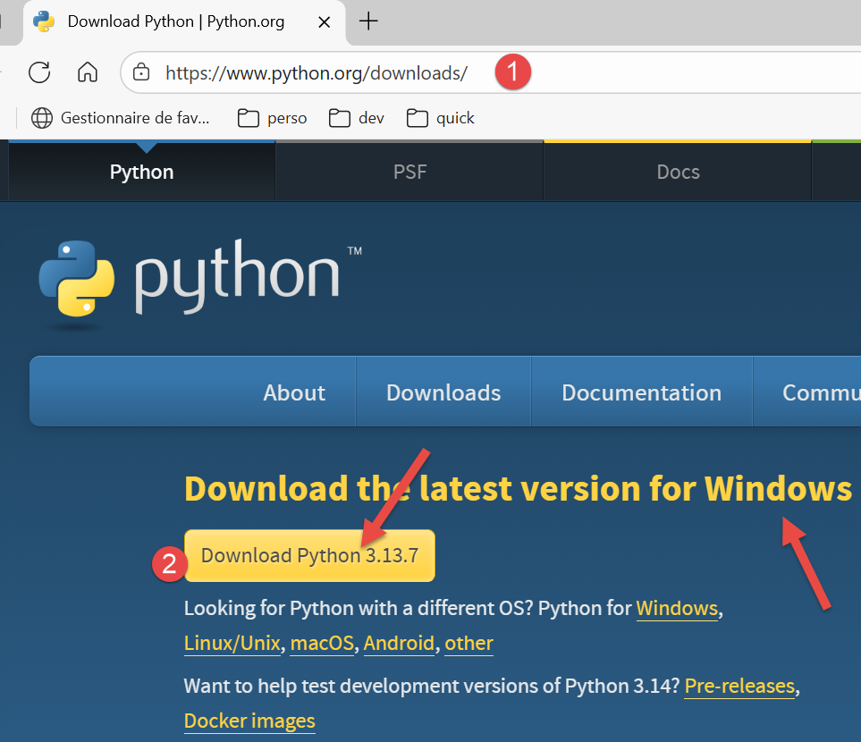

En [1-2] téléchargez l’exécutable de l’installateur de Python puis exécutez-le.

L'installation de Python donne naissance à l'arborescence de fichiers [1] suivante :


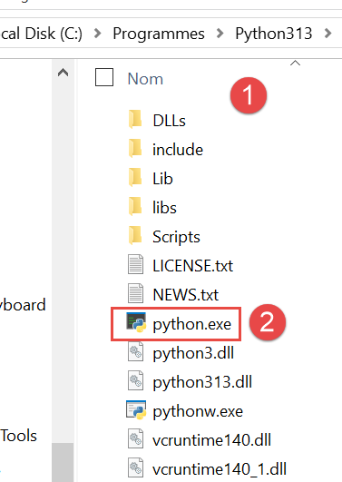

Pour exécuter Python en mode interactif, double-cliquez sur [2]. Voici un exemple de code Python à exécuter :


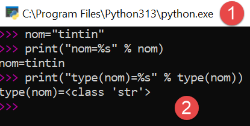

Le prompt >>> permet d'émettre une instruction Python qui est immédiatement exécutée. Le code tapé ci-dessus a la signification suivante :

```python linenums="1"
>>> nom="tintin"
>>> print("nom=%s" % nom)
nom=tintin
>>> print("type=%s" % type(nom))
type=<class 'str'>
>>>
```

Lignes :

- 1 : initialisation d'une variable. En Python, on ne déclare pas le type des variables. Celles-ci ont automatiquement le type de la valeur qu'on leur affecte. Ce type peut changer au cours du temps ;
- 2 : affichage du nom. 'nom=%s' est un format d'affichage où %s est un paramètre formel désignant une chaîne de caractères. nom est le paramètre effectif qui sera affiché à la place de %s ;
- 3 : le résultat de l'affichage ;
- 4 : l'affichage du type de la variable nom ;
- 5 : la variable nom est ici de type class. Avec Python 2.7 elle aurait la valeur <type 'str'> ;
Maintenant, ouvrons une console Windows :


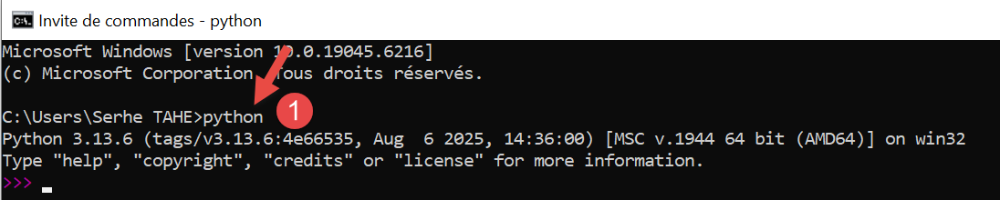

Le fait qu'on ait pu taper [python] en [1] et que l'exécutable [python.exe] ait été trouvé montre que celui-ci est dans le PATH de la machine Windows. C'est important car cela signifie que les outils de développement Python sauront trouver l'interpréteur Python. On peut le vérifier ainsi :


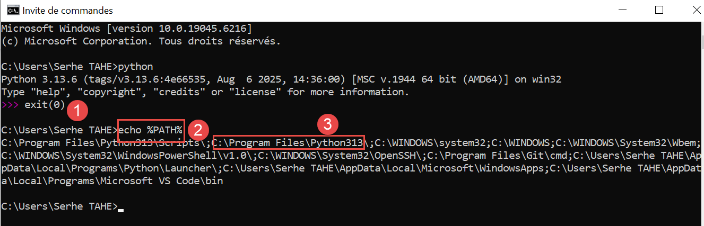

- En [1], on quitte l'interpréteur Python ;
- En [2], la commande qui affiche le PATH des exécutables de la machine Windows ;
- En [3], on voit que le dossier de l'interpréteur Python 3.13 fait partie du PATH ;
## 3.2. L'IDE PyCharm Community
Pour construire et exécuter les scripts de ce document, nous avons utilisé l'éditeur [PyCharm] Edition Community disponible (août 2025) à l'URL |[https://www.jetbrains.com/fr-fr/pycharm/download/#section=windows](https://www.jetbrains.com/fr-fr/pycharm/download/%23section=windows)| :


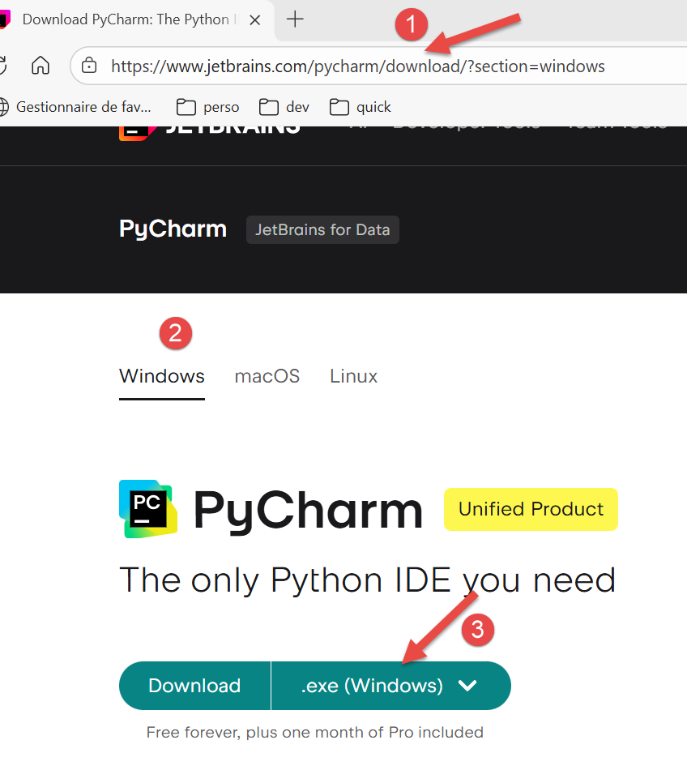


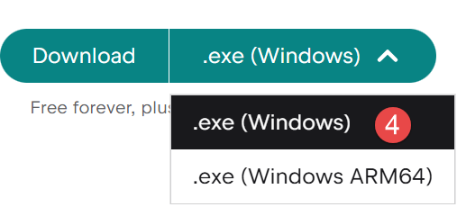

Téléchargez l'IDE PyCharm Community (ici pour Windows) [1-4] et installez-le.

Lançons l'IDE PyCharm. Un panneau de configuration apparaît :


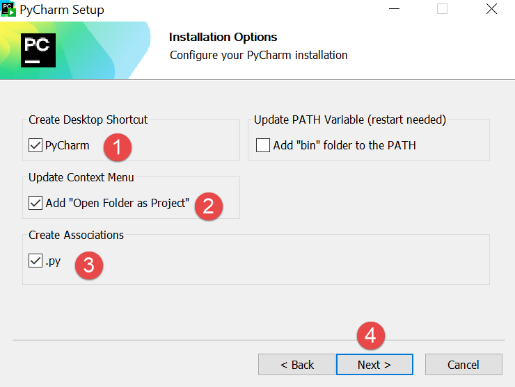

- En [1] pour créer l’icône PyCharm sur le bureau ;
- En [2] pour ouvrir n’importe quel dossier du système de fichiers comme un projet Python ;
- En [3], les fichiers Python auront le suffixe .py ;
- En [4], passer à l’étape suivante ;
La fenêtre suivante propose de nouveau de la configuration [1] :


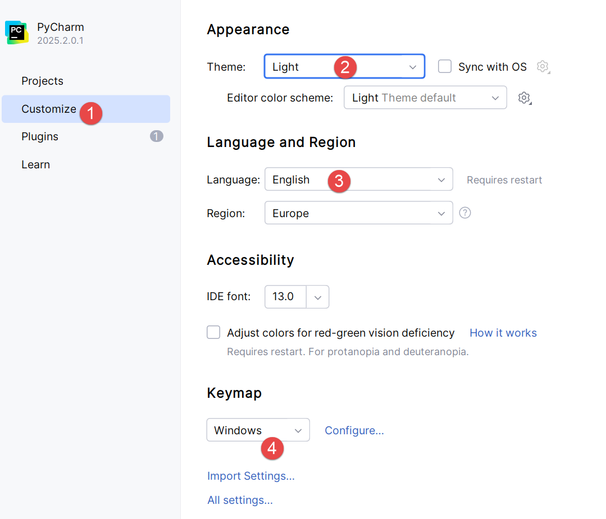

- En [2], on prend le thème [Light]. Le lecteur prendra le thème de son choix ;
- En [3], on laisse l’IDE en anglais ;
- En [4], on garde les raccourcis de Windows ;
Créons un premier projet Python [1-2] :


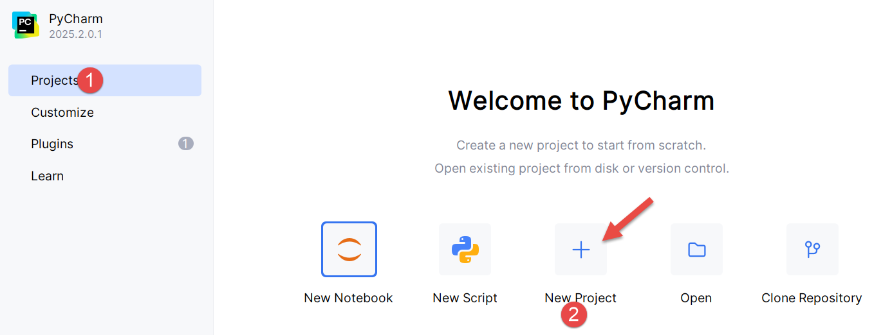

Cela ouvre la fenêtre suivante :


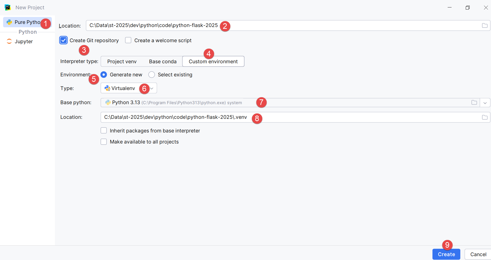

- En [2], indiquer le nom du dossier à créer pour le projet ;
- En [3], indiquer que les différentes versions du code qui seront sauvegardées seront gérées par le gestionnaire de versions Git. PyCharm permet d’en utiliser d’autres ;
- En [4-6], indiquer que votre projet va utiliser un environnement virtuel. L’environnement virtuel va créer un dossier [.venv] à la racine du projet. Tous les plugins (packages) utilisés par votre projet iront dans ce dossier. Cela assure une étanchéité entre projets lorsqu’il y a recherche de plugins. Le projet ne cherche ses plugins que dans son propre environnement virtuel [.venv] et pas ailleurs où il pourrait trouver des plugins de mêmes noms mais de versions peut-être différentes qui sont parfois partiellement incompatibles entre elles ;
L'IDE PyCharm présente le projet créé sous la forme suivante :


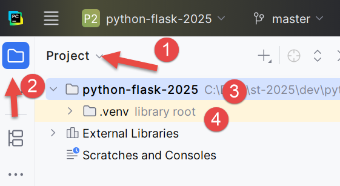

- En [1-2], l’arborescence du projet ;
- En [3], le dossier du projet ;
- En [4], le dossier de l’environnement virtuel du projet. C’est dans ce dossier que s’installeront les plugins que nous utiliserons pour le projet ;
Avant de commencer à coder, allons plus loin dans la configuration de l’IDE :


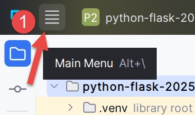

- Cliquer sur [1] pour faire apparaître le menu principal ;

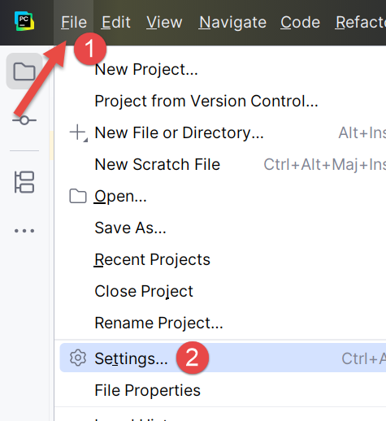

- En [1-2], configurez l’IDE ;

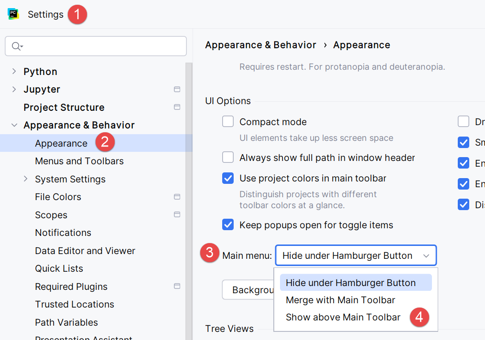

- En [1-4], indiquez que vous voulez voir le menu principal au-dessus de la barre d’outils principale. Rien ne vous y oblige. On le fait ici pour éclairer les copies d’écran qui sont produites dans ce document. Validez votre changement ;
Désormais, le menu principal est toujours affiché [1] :


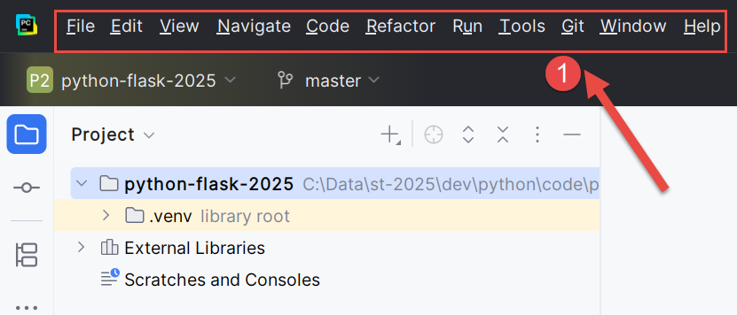

Continuons la configuration de l’IDE :


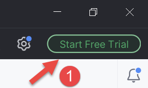

En haut à droite de la fenêtre de PyCharm, on propose d’essayer la version pro de PyCharm. Selon la façon dont vous avez installé PyCharm, il se peut même que la version pro ait été installée d’office (2025). Cela amène des options de menu supplémentaires.


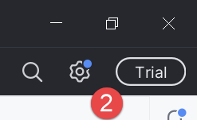

Si vous avez installé la version pro d’évaluation pour un essai d’un mois, vous avez le message [2] en haut à droite.

Toujours pour la cohérence des copies d’écran qui vont suivre, je montre comment annuler la version d’essai pro de l’IDE (vous pouvez y revenir quand vous voulez) :


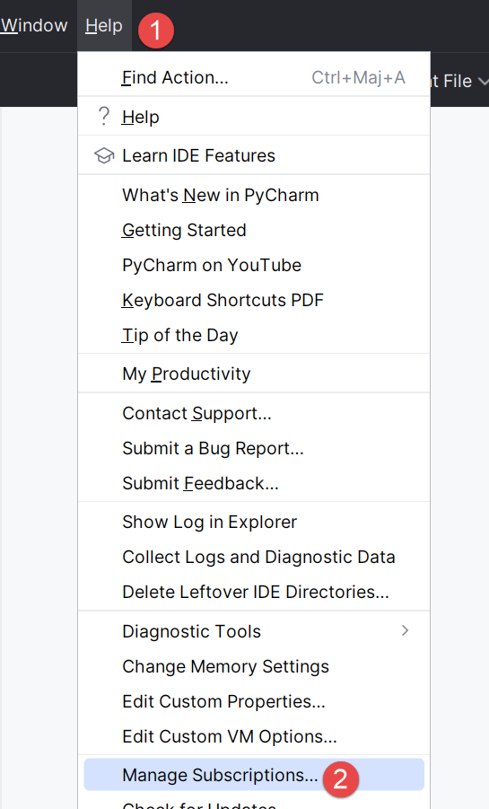

- En [1-2], gérez les souscriptions de votre IDE ;

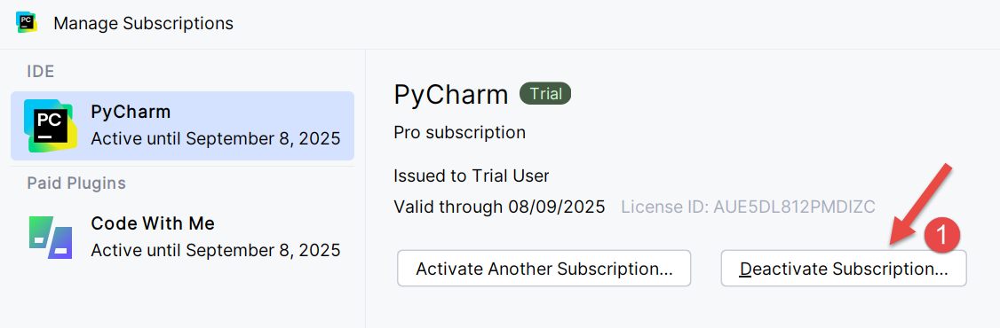

- En [1], désactivez la version pro. L’IDE va se relancer ;
Maintenant configurons l’interpréteur Python qui va exécuter notre projet. Nous nous souvenons d’en avoir téléchargé un lors d’une étape précédente :


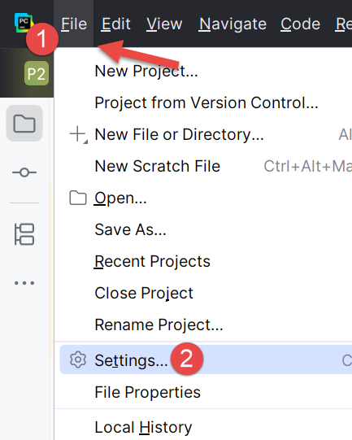


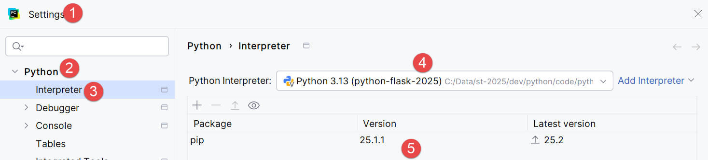

- En [1-3], nous configurons l’interpréteur Python du projet ;
- En [4], le chemin de l’interpréteur ;
- En [5], les packages (plugins) associés à cet interpréteur ;
En [4], découvrons le chemin complet de l’interpréteur utilisé :


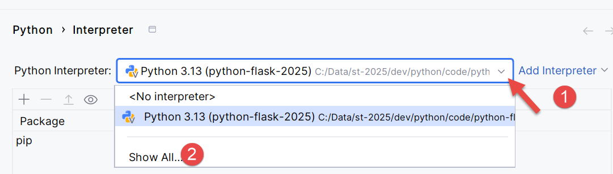


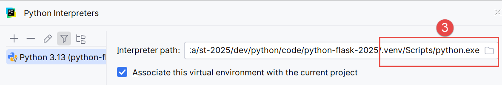

- En [3], on découvre que l’interpréteur Python utilisé se trouve dans le dossier de l’environnement virtuel du projet [.venv] ;
Il est possible de changer d’interpréteur Python, ce qui peut changer les plugins disponibles au projet :


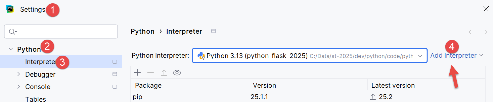

- En [4], ajoutez un interpréteur Python ;

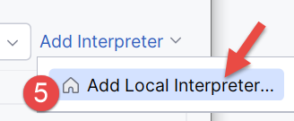

- En [5], ajoutez un interpréteur local. PyCharm va alors explorer le PATH de la machine à la recherche d’un binaire [python.exe] ;

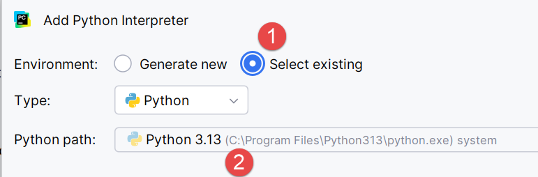

- En [1], indiquez que le nouvel interpréteur doit utiliser l’environnement virtuel [.venv] existant du projet ;
- En [2], l’IDE propose comme interpréteur l’application Python installée dans une étape précédente ;
- Validez ce choix ;

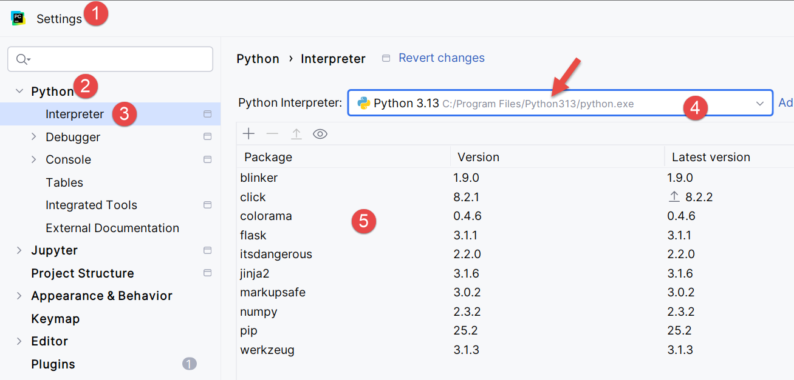

- En [4], le nouvel interpréteur ;
- En [5], les packages auxquels aura accès le projet. C’est la principale différence amenée par le changement d’interpréteur. Si vous gérez plusieurs projets qui utilisent différents packages il est préférable d’utiliser les packages de l’environnement virtuel de chaque projet. Ainsi vous avez le contrôle des versions des plugins que vous utilisez. Pour cette raison, nous garderons l’interpréteur de l’environnement virtuel :

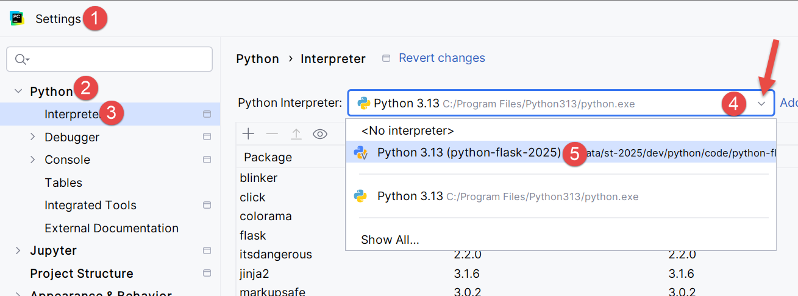


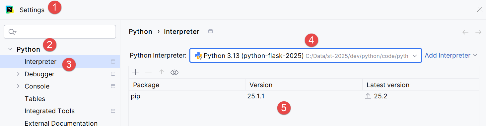

Allons un peu plus loin dans la configuration :

<table>
<tr>
<td>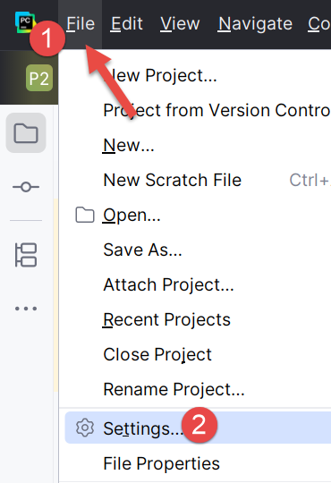</td>
<td>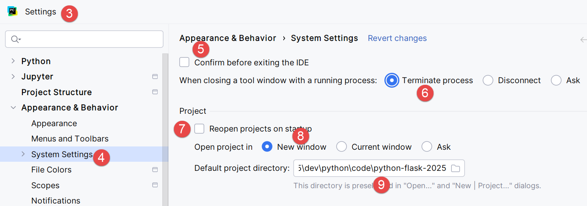</td>
</tr>
</table>
- En [1-2], entrez dans le mode configuration de l’IDE ;
- En [3-4], configurez des options du système ;
- En [5], pas de confirmation avant de quitter l’IDE ;
- En [6], lorsqu’on quitte l’IDE et qu’il y a un processus en cours d’exécution lancé par le code exécuté, on arrête celui-ci ;
- En [7], lorsque l’IDE est lancée, on ne rouvre pas automatiquement le dernier projet utilisé. On laisse l’utilisateur choisir son projet ;
- En [8], lorsque l’utilisateur gère plusieurs projets en même temps, chaque projet a sa fenêtre personnelle ;
- En [9], on a désigné le dossier par défaut de notre projet ;
Maintenant nous pouvons commencer à coder. Commençons par créer un dossier dans lequel nous mettrons notre premier script Python :

<table>
<tr>
<td>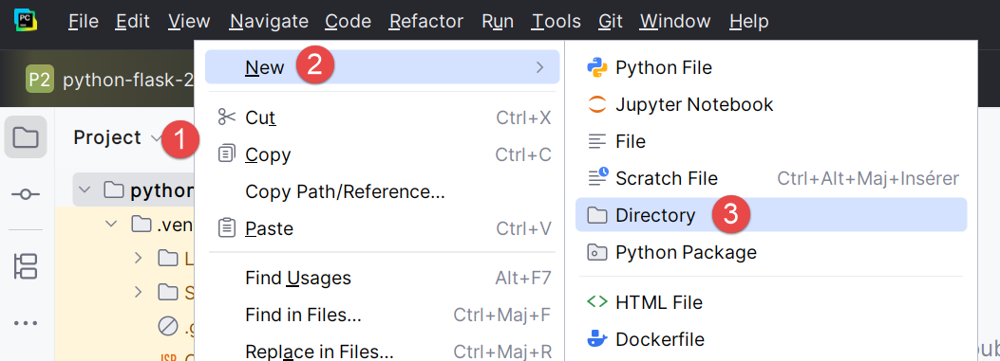</td>
<td>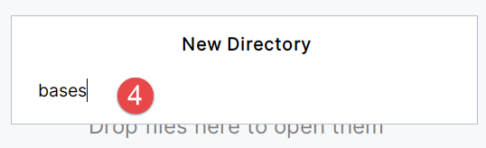</td>
</tr>
</table>
- Cliquer droit sur le projet, puis [1-3] pour créer un dossier ;
- En [4], tapez le nom du dossier : il sera créé dans le dossier du projet ;

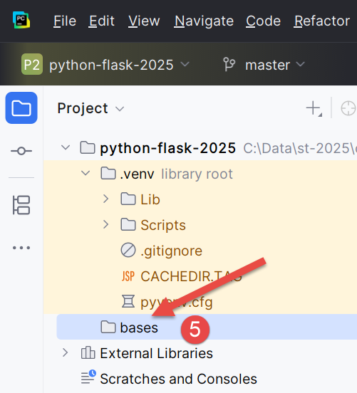

Puis créons un script Python :

<table>
<tr>
<td>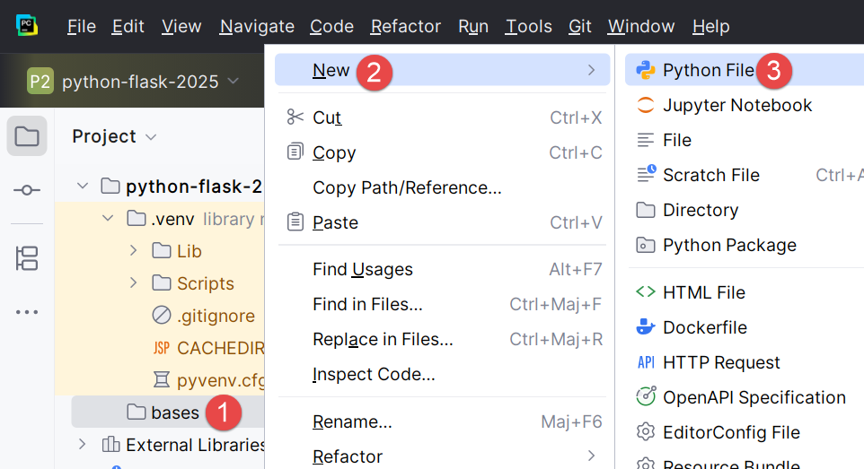</td>
<td>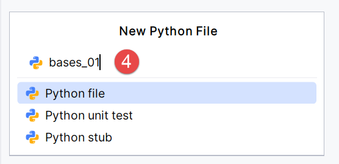</td>
</tr>
</table>
Cliquer droit sur le dossier [bases], puis [1-4] :

<table>
<tr>
<td>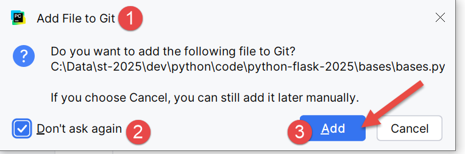</td>
<td>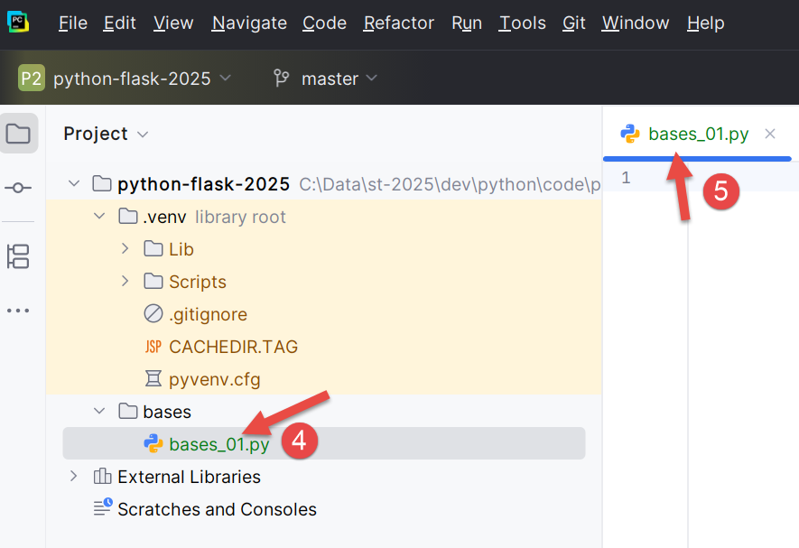</td>
</tr>
</table>
- Rappelons-nous ici que nous avons inclus le gestionnaire de versions Git à notre projet. Cela s’est fait lors de la création du projet où nous avons coché l’option Git. Git peut prendre des photos du projet à différentes étapes de celui-ci. Ici en [1-3], l’IDE nous demande si nous voulons inclure le fichier [bases.py] que nous sommes en train de créer dans la photo. Nous répondons oui [3]. Par ailleurs nous cochons [2] pour que cela soit fait systématiquement à la création d’un fichier. Nous reviendrons brièvement sur Git un peu plus loin ;
- En [4-5], le script [bases_01] a été créé et est prêt à être édité ;
Écrivons notre premier script :

<table>
<tr>
<td>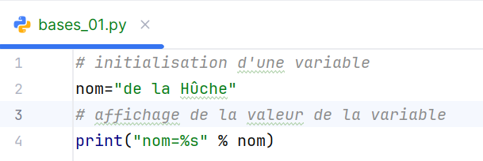</td>
<td>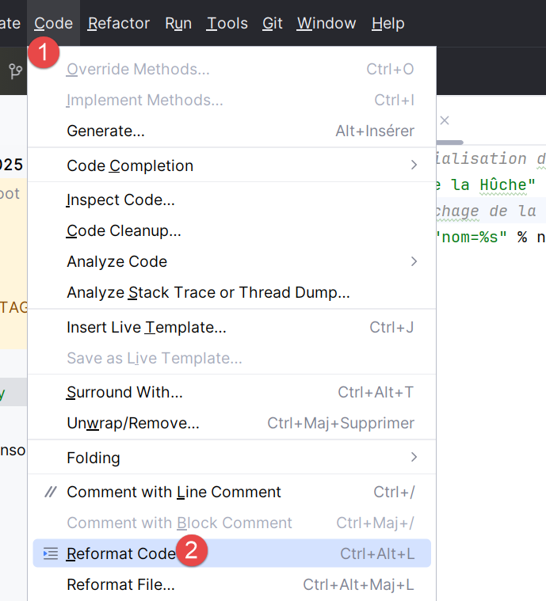</td>
</tr>
</table>
- Lignes 1, 3 : les commentaires commencent avec le signe # ;
- Ligne 2 : initialisation d'une variable. Python ne déclare pas le type de ses variables ;
- Ligne 4 : affichage écran. La syntaxe utilisée ici est [format % données] avec :
    - format : nom=%s où %s désigne l'emplacement d'une chaîne de caractères. Celle-ci sera trouvée dans la partie [données] de l'expression ;
    - données : la valeur de la variable [nom] viendra remplacer le format %s dans la chaîne de format ;
- Avec [1-2], on reformate le code selon les recommandations de l'organisme gérant Python. On peut aussi taper au clavier la séquence Ctrl-Alt-L ;
Sur la copie d’écran on voit que certains textes sont soulignés. PyCharm signale des erreurs d’orthographe dans les commentaires et chaînes de caractères. Il les appelle des typos. Il est par défaut configuré pour des textes en anglais. Pour éviter le signalement des typos en français, procédons comme suit :

<table>
<tr>
<td>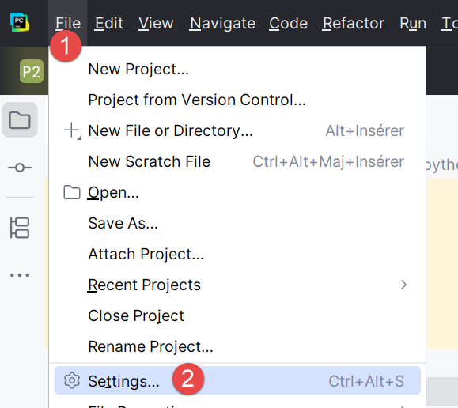</td>
<td>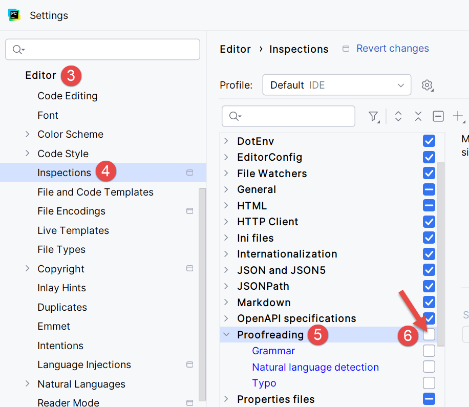</td>
</tr>
</table>
- En [1-2], configurons l’IDE ;
- En [3-6], désactivons l’option [Proofreading] de l’éditeur ;
<table>
<tr>
<td>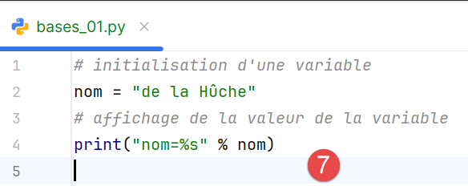</td>
<td>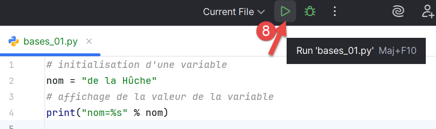</td>
</tr>
</table>
En [7], le signalement des typos a disparu. Le script est exécuté avec un clic sur l’icône [8] de la barre d’outils principale. Le résultat est le suivant :


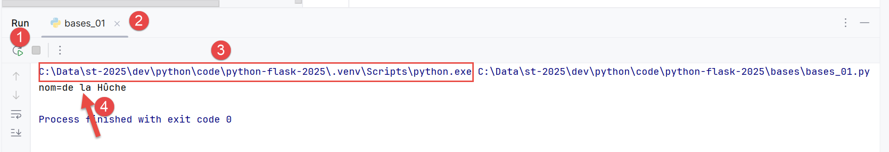

- En [1-2], une fenêtre de résultats s’est ouverte ;
- En [3], on voit que le code de [bases_01.py] a été exécuté par l’interpréteur Python de l’environnement virtuel du projet ;
- En [4], le résultat de l’exécution ;
Pour exécuter les scripts de ce document, téléchargez le code à l'URL |[Générer un script Python avec des outils d'IA](https://onedrive.live.com/?redeem=aHR0cHM6Ly8xZHJ2Lm1zL2YvYy9mNTNhOTE5ZjQzZDI3ZWI1L0VpNzRCOGJkaDNoSXR6MktmZHVTSTJ3QnYwVGtMaklnVkRjOENfX01SWHk3M2c%5FZT1UdHU5eFM&id=F53A919F43D27EB5%21sc607f82e87dd4878b73d8a7ddb92236c&cid=F53A919F43D27EB5)| (cloud OneDrive) puis dans PyCharm procédez comme suit :

<table>
<tr>
<td>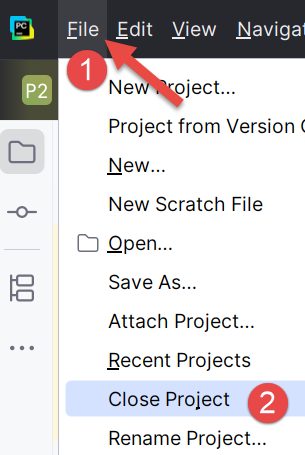</td>
<td></td>
<td></td>
</tr>
</table>
- En [1-2], fermez le projet sur lequel vous êtes en train de travailler ;

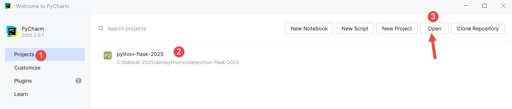

- En [1], on choisit l’option [Projects] ;
- Dans la fenêtre [2], on a la liste des derniers projets sur lesquels on a travaillé ;
- En [3], on indique qu’on veut ouvrir un projet existant ;
<table>
<tr>
<td>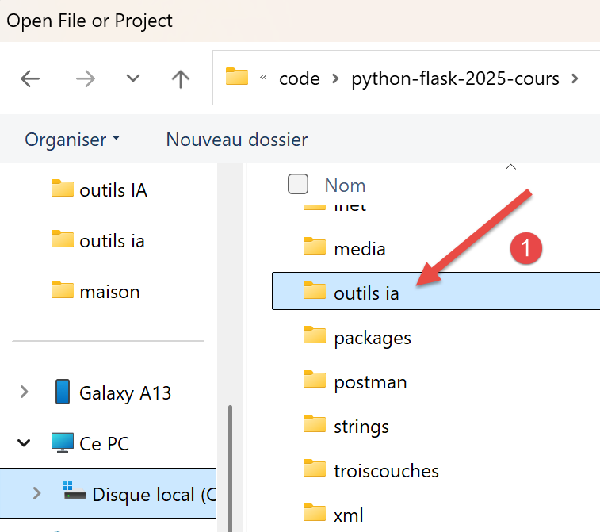</td>
<td></td>
</tr>
</table>
- En [1], on ouvre le dossier qu’on a téléchargé ;
<table>
<tr>
<td>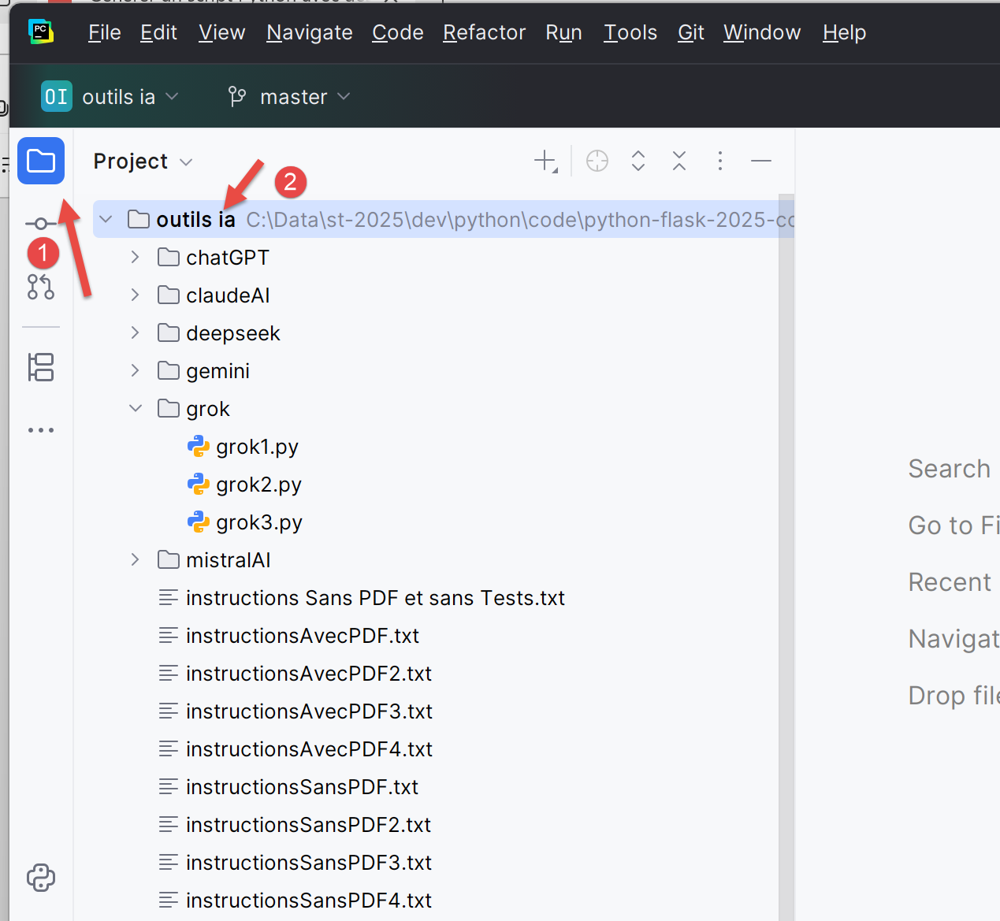</td>
<td></td>
</tr>
</table>
- En [1-2], le projet PyCharm ;
Configurons ce projet pour qu’il ait un environnement virtuel d’exécution :

<table>
<tr>
<td>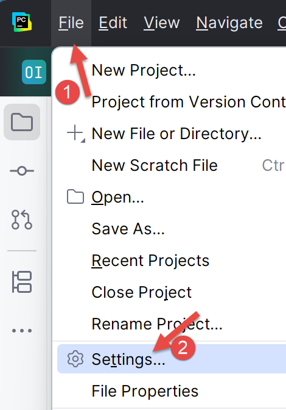</td>
<td></td>
</tr>
</table>
- En [1-2], on configure le nouveau projet ;
<table>
<tr>
<td>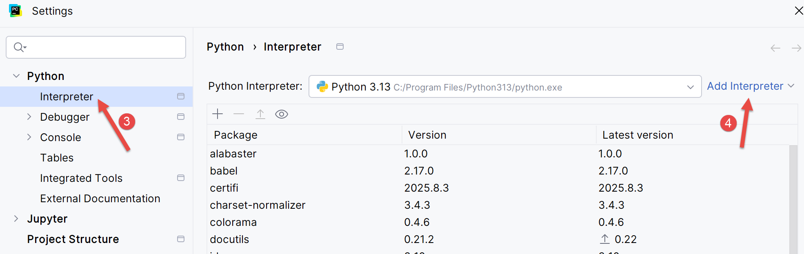</td>
<td></td>
</tr>
</table>
- En [3-4], on configure un interpréteur pour le projet ;
<table>
<tr>
<td>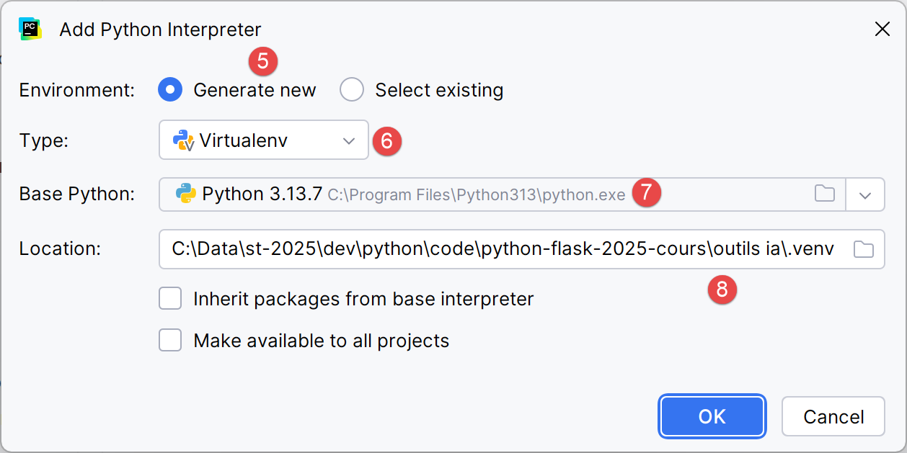</td>
<td></td>
</tr>
</table>
- En [5-6], on choisit un environnement virtuel d’exécution ;
<table>
<tr>
<td>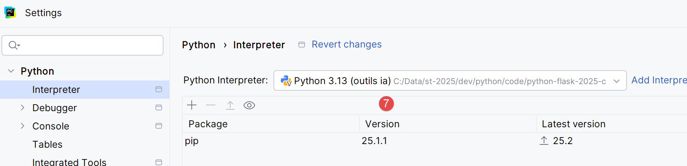</td>
<td></td>
</tr>
</table>
- En [7], le nouvel interpréteur Python utilisé pour le projet ;
Ceci fait, vous pouvez exécuter les scripts du projet :

<table>
<tr>
<td>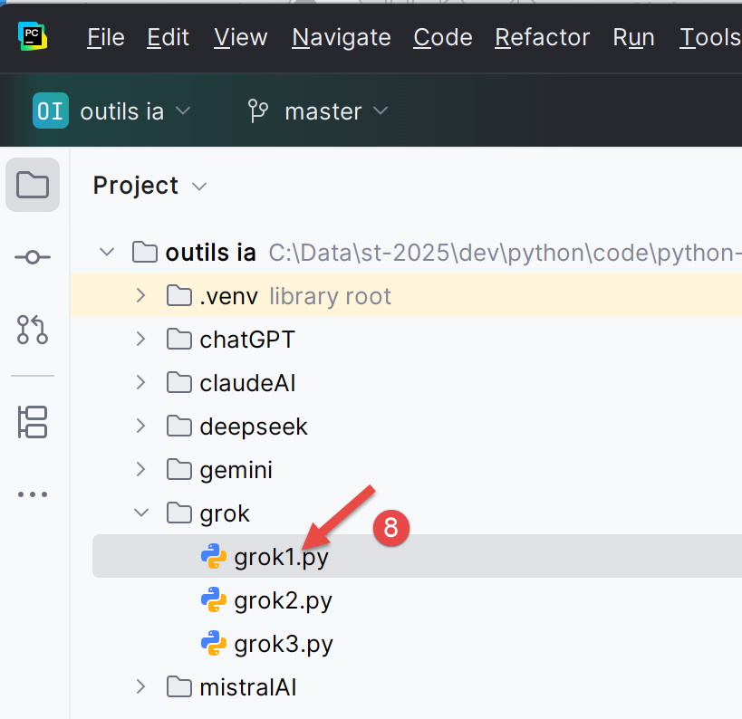</td>
<td></td>
</tr>
</table>