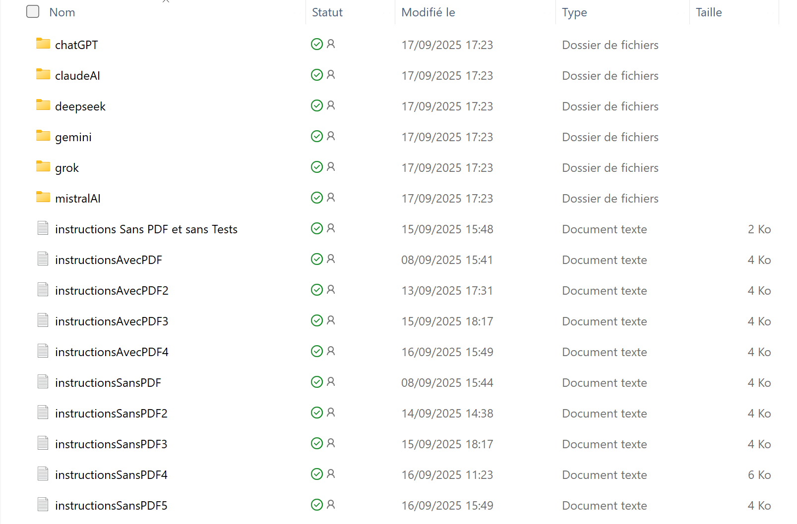
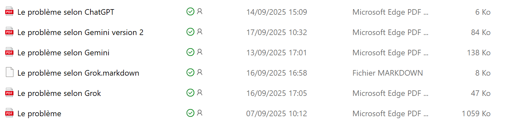

# 1. Introduction
On se propose ici de reprendre un problème exposé en 2020 dans le cours [[python3-flask-2020](https://tahe.developpez.com/tutoriels-cours/python-flask-2020/)]. Ce cours prenait comme base un calcul d’impôt simplifié pour l’année 2019. Un script Python était développé pour résoudre le problème puis décliné en de multiples versions (18) jusqu’à porter le calcul de l’impôt dans une application web MVC.

On se propose ici de montrer que le script initial du calcul de l’impôt peut être désormais généré par des outils d’IA (Intelligence Artificielle). On a utilisé sept outils : ChatGPT, Grok, Gemini, MistralAI, DeepSeek, ClaudeAI, Perplexity. Il en existe d’autres.

Le document ne nécessite pas forcément de connaître le langage Python. Les sept outils doivent générer un script Python comportant au début 11 tests unitaires, puis pour finir 25 tests. Il suffit de charger ce code dans un environnement de travail Python, de l’exécuter et de vérifier que les tests sont réussis. Ensuite ce code généré peut être considéré comme « probablement correct ». L’utilisateur Python lui s’intéressera davantage au code. Il s’apercevra alors que les scripts Python générés sont en général très bien écrits.

Par ailleurs, ce document montre que les outils d’IA utilisés sont d’un usage plutôt facile et que le dialogue entre l’utilisateur (vous) et l’outil d’IA n’est pas différent de celui qu’aurait un enseignant avec son élève / étudiant.

Ce document a été écrit en septembre 2025. L’IA évolue vite et il est possible que les copies d’écran qui suivent deviennent rapidement obsolètes. Si vous posez les mêmes questions que le document, il est très plausible que vous obteniez des réponses différentes que celles obtenues ici. Suivez simplement le processus d’affinage de vos instructions, montré ici, pour aider l’IA.

Vous pouvez télécharger les codes et fichiers de ce tutoriel à l’adresse : [[Générer un script Python avec des outils d'IA](https://tahe.developpez.com/tutoriels-cours/python-ia-sept2025/documents/python-ia-sept2025.rar)] :

<table>
<tr>
<td></td>
<td></td>
</tr>
</table>
<table>
<tr>
<td></td>
<td></td>
</tr>
</table>