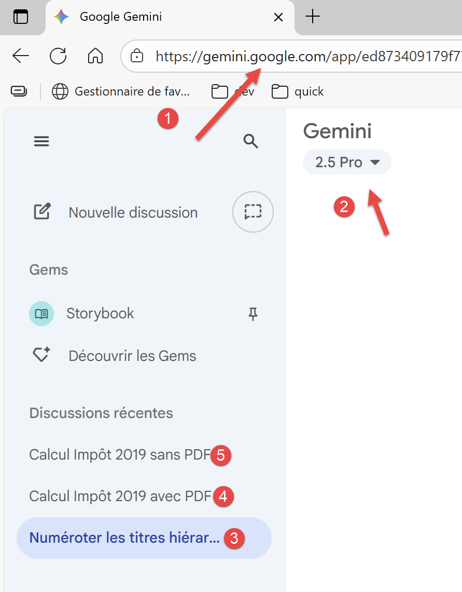
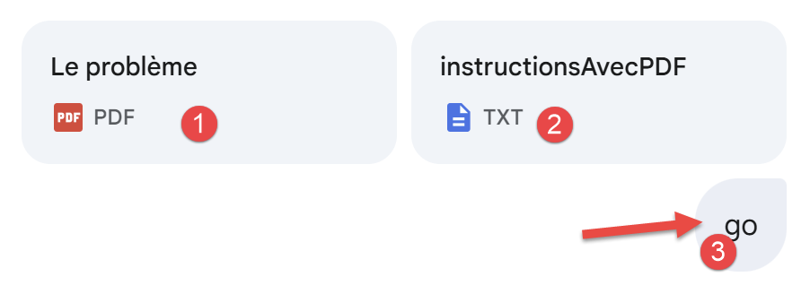
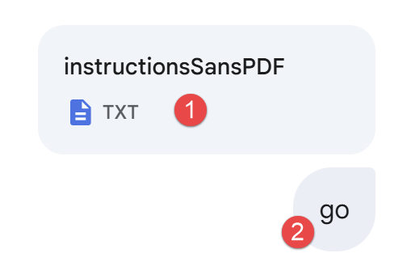

# 2. Les trois problèmes étudiés et les résultats
On va demander aux IA d’étudier trois problèmes du plus simple au plus compliqué. Regardons une copie d’écran de Google Gemini :

<table>
<tr>
<td></td>
<td></td>
</tr>
</table>
- En [1], l’URL de Gemini ;
- En [2], la version de Gemini utilisée ;
- En [3-5], les trois problèmes posés à Gemini ;
### 2.0.1. Problème 1
Le problème 1 est une simple question :

<table>
<tr>
<td></td>
<td></td>
</tr>
</table>
Toutes les IA répondront correctement à cette question.

### 2.0.2. Problème 2
Le problème 2 est le suivant (copie d’écran de Gemini) :

<table>
<tr>
<td></td>
<td></td>
</tr>
</table>
- En [1], le principe du calcul de l’impôt 2019 sur les revenus 2018 est expliqué dans un PDF. Nous y reviendrons ;
- En [2], on donne des instructions précises à Gemini sur ce qu’on veut, un script Python propre qui résout le problème posé et qui valide la solution proposée avec 11 tests unitaires ;
- En [3], pour lancer Gemini on doit écrire quelque chose ;
On est là exactement dans le même cas que celui d’un TD donné à l’université.

Les IA testées vont résoudre le problème à l’exception de MistralAI et Perplexity.

### 2.0.3. Problème 3
Toujours avec une copie d’écran de Google Gemini, le problème 3 est le suivant :

<table>
<tr>
<td></td>
<td></td>
</tr>
</table>
- En [1] on donne nos instructions, les mêmes que précédemment. Mais comme on ne donne pas le PDF qui donnait les règles exactes de calcul. L’IA va devoir chercher ces règles sur internet ;
- En [3], on lance l’exécution de l’IA ;
Seules trois IA ont passé ce test, dans l’ordre d’excellence (avis strictement personnel, cela va de soi) :

- ChatGPT d’OpenAI ;
- Grok de xAI ;
- Goggle Gemini ;
L’IA ClaudeAI a échoué sur le problème 3. L’IA MistralAI a échoué sur les problèmes 2 et 3, de même que l’IA Perplexity. L’IA DeepSeek a échoué sur le problème 3.
