# 5. Résolution des trois problèmes avec ChatGPT
## 5.1. Introduction
Voici une première copie d’écran d’une session ChatGPT :

<table>
<tr>
<td></td>
<td></td>
</tr>
</table>
- En [1-3], les trois problèmes posés à ChatGPT ;
- En [4], l’URL de ChatGPT ;
- En [5], la version de ChatGPT utilisée ;

ChatGPT est un produit de OpenAI disponible à l’URL [https://chatgpt.com/]. Pour avoir un historique de vos sessions de questions / réponses comme ci-dessus, il vous faut créer un compte. Par ailleurs, comme toutes les autres IA testées, ChatGPT limite le nombre de vos questions et le nombre de fichiers téléchargés. Quand cette limite est atteinte, la session est terminée et on vous propose de la continuer plus tard dans le temps. Les limites imposées par ChatGPT sont atteintes très rapidement. Pour faire ce tutoriel, j’ai du prendre un abonnement payant d’un mois.

L’interface de ChatGPT est la suivante :

<table>
<tr>
<td></td>
<td></td>
</tr>
</table>
- En [1], pour joindre des fichiers à la question posée ;
- En [2], la question posée ;
- En [3], pour lancer l’exécution de l’IA ;
## 5.2. Le problème 1
La question à ChatGPT :

<table>
<tr>
<td></td>
<td></td>
</tr>
<tr>
<td></td>
<td></td>
</tr>
</table>
ChatGPT répond correctement.

## 5.3. Le problème 2
C’est le calcul de l’impôt avec le PDF. Pour être honnête, on va utiliser le PDF généré par Gemini qui corrige des erreurs du PDF initial.

<table>
<tr>
<td></td>
<td></td>
</tr>
</table>
- En [1], on a donné le PDF généré par Gemini ;
- En [2], on a ajouté le test unitaire par lequel Gemini a démontré sa supériorité :
```python linenums="1"
test12 : (2, 2, 49500) -> (1297, 431, 324)
```

On lance ChatGPT. Il met environ 3 minutes pour générer sa réponse. Contrairement à Gemini, il livre bien un lien qui marche pour récupérer le script généré. On charge celui-ci dans PyCharm :

<table>
<tr>
<td>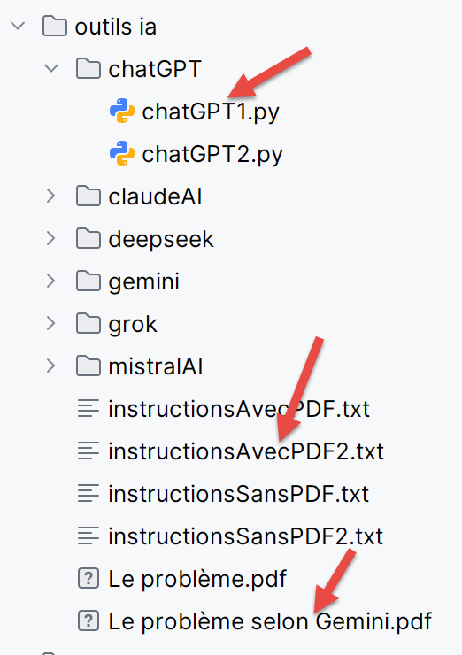</td>
<td></td>
</tr>
</table>
Le script [chatGPT1] fonctionne du premier coup. Là il n’y a pas photo, sur ce problème ChatGPT a été plus performant que Gemini.

Le script [chatGPT1] fourni par ChatGPT est le suivant :

```python linenums="1"
# -*- coding: utf-8 -*-
"""
Calcul de l'impôt 2019 (revenus 2018) en Python.
Hypothèses et règles (d'après le PDF fourni) :
- Tous les revenus sont portés sur le déclarant 1 (même pour un couple).
- Abattement forfaitaire de 10 % encadré par un minimum et un maximum.
- Barème progressif 2018 appliqué au quotient familial (QF).
- Plafonnement du quotient familial : avantage par demi-part enfant limité.
- Décote et réduction de 20 % pour faibles revenus, avec la règle de repêchage.
- Ordre des correctifs : plafonnement QF -> décote -> réduction 20 %.
- Arrondis : abattement (↑), décote (↑), réduction (↑), impôt final (↓).
- On renvoie l'impôt à payer (arrondi à l'euro inf.), la décote et la réduction
  (arrondies à l'euro sup.).
Les nombres “magiques” sont regroupés en constantes, et chaque étape est isolée
dans des fonctions pour la clarté.
"""
from dataclasses import dataclass
from math import ceil, floor
# ---------- Constantes réglementaires ----------
# Abattement frais pro (plancher/plafond) pour revenus 2018
ABATTEMENT_TAUX = 0.10
ABATTEMENT_MIN = 437
ABATTEMENT_MAX = 12502
# Barème 2018 (QF)
# Chaque tranche est (borne_sup, taux). La première tranche 0% se termine à 9 964 €.
BAREME_2018 = [
    (9964, 0.00),
    (27519, 0.14),
    (73779, 0.30),
    (156244, 0.41),
    (float("inf"), 0.45),
]
# Plafonnement du quotient familial
PF_QF_AVANTAGE_PAR_DEMI_PART = 1551  # avantage max par 1/2 part ENFANT
# Décote (seuils selon le nombre d'adultes / statut couple)
DECOTE_SEUIL_CELIB = 1196
DECOTE_SEUIL_COUPLE = 1970
# Réduction de 20 % : seuils en fonction des parts
REDUCTION_BASE_1_PART = 18985
REDUCTION_BASE_2_PARTS = 37970
REDUCTION_PAR_DEMI_PART_SUP = 3803  # ajout par 1/2 part au-delà du socle de 1 ou 2 parts
# ---------- Structures de données ----------
@dataclass
class ResultatImpot:
    impot: int  # impôt final à payer, arrondi à l'euro inférieur
    decote: int  # décote arrondie à l'euro supérieur
    reduction: int  # réduction 20 % arrondie à l'euro supérieur
# ---------- Fonctions utilitaires ----------
def arrondi_sup(euros: float) -> int:
    """Arrondi à l'euro supérieur (ceil)."""
    return int(ceil(euros))
def arrondi_inf(euros: float) -> int:
    """Arrondi à l'euro inférieur (floor)."""
    return int(floor(euros))
# ---------- Étape 1 : Revenu Net Imposable (RNI) ----------
def calcul_abattement(revenus_bruts: float) -> int:
    """
    Calcule l'abattement de 10 %, plafonné/planche, ARRONDI À L'EURO SUPÉRIEUR.
    """
    abattement_calcule = revenus_bruts * ABATTEMENT_TAUX
    abattement_calcule = max(ABATTEMENT_MIN, min(ABATTEMENT_MAX, abattement_calcule))
    return arrondi_sup(abattement_calcule)
def revenu_net_imposable(revenus_bruts: float) -> int:
    """RNI = revenus bruts - abattement (abattement arrondi ↑)."""
    return int(round(revenus_bruts - calcul_abattement(revenus_bruts)))
# ---------- Étape 2 : Nombre de parts ----------
def nombre_parts(adultes: int, enfants: int) -> float:
    """
    Règles : 1 part si 1 adulte, 2 parts si 2 adultes.
    Enfants : +0,5 pour les 2 premiers, +1 par enfant à partir du 3e.
    (On ignore ici tout cas particulier type parent isolé, conformément au PDF.)
    """
    parts = 1.0 if adultes == 1 else 2.0
    if enfants <= 0:
        return parts
    if enfants == 1:
        return parts + 0.5
    # enfants >= 2
    parts += 1.0  # +0,5 +0,5 pour les deux premiers
    if enfants > 2:
        parts += (enfants - 2) * 1.0  # +1 par enfant à partir du 3e
    return parts
def demi_parts_enfants(enfants: int) -> int:
    """Nombre de DEMI-parts dû aux enfants (utile pour le plafonnement QF)."""
    if enfants <= 0:
        return 0
    if enfants == 1:
        return 1  # 0,5 part
    # Deux premiers enfants = 2 * demi-part, puis +2 demi-parts par enfant à partir du 3e
    return 2 + (enfants - 2) * 2
# ---------- Étape 3 : Impôt brut via QF ----------
def impot_brut_par_parts(qf: float) -> float:
    """Impôt par part via barème progressif 2018 (sans arrondi)."""
    imp = 0.0
    previous = 0.0
    for borne_sup, taux in BAREME_2018:
        montant_tranche = max(0.0, min(qf, borne_sup) - previous)
        imp += montant_tranche * taux
        if qf <= borne_sup:
            break
        previous = borne_sup
    return imp
def impot_brut_total(rni: float, parts: float) -> float:
    """Impôt brut total = impôt par part * nombre de parts (sans arrondi)."""
    if parts <= 0:
        return 0.0
    qf = rni / parts
    return impot_brut_par_parts(qf) * parts
# ---------- Étape 4.1 : Plafonnement du quotient familial ----------
def apply_plafonnement_qf(impot_avec_enfants: float, rni: float, adultes: int, enfants: int) -> float:
    """
    Calcule l'impôt après plafonnement QF si l'avantage des enfants dépasse le plafond.
    - Impôt A : avec parts incluant enfants
    - Impôt B : avec seulement parts des adultes (1 ou 2)
    - Avantage réel = B - A
    - Avantage maximal = 1551 € par 1/2 part ENFANT
    Si avantage réel > avantage max, impôt = B - avantage max, sinon impôt = A.
    """
    parts_adultes = 1.0 if adultes == 1 else 2.0
    imp_b = impot_brut_total(rni, parts_adultes)
    imp_a = impot_avec_enfants
    avantage_reel = max(0.0, imp_b - imp_a)
    avantage_max = PF_QF_AVANTAGE_PAR_DEMI_PART * demi_parts_enfants(enfants)
    if avantage_reel > avantage_max:
        return imp_b - avantage_max
    return imp_a
# ---------- Étape 4.2 : Décote et Réduction 20 % ----------
def seuil_decote(adultes: int) -> int:
    return DECOTE_SEUIL_COUPLE if adultes >= 2 else DECOTE_SEUIL_CELIB
def seuil_reduction_20(rni: int, adultes: int, parts: float) -> int:
    """
    Seuil d'éligibilité à la réduction de 20 % :
    - Base : 18 985 € pour 1 part, 37 970 € pour 2 parts
    - + 3 803 € par 1/2 part supplémentaire au-delà de la base correspondante.
    """
    base = REDUCTION_BASE_2_PARTS if adultes >= 2 else REDUCTION_BASE_1_PART
    base_parts = 2.0 if adultes >= 2 else 1.0
    demi_sup = max(0, int(round((parts - base_parts) * 2)))
    return base + demi_sup * REDUCTION_PAR_DEMI_PART_SUP
def calc_decote_reduction(impot_apres_plaf: float, rni: int, adultes: int, parts: float):
    """
    Calcule (decote_arrondie, reduction_arrondie, impot_apres_correctifs).
    Règle d'interaction : la décote peut s'appliquer via repêchage si, après
    application THÉORIQUE de la réduction de 20 %, l'impôt passerait sous le seuil.
    Ordre : décote -> réduction.
    """
    imp = max(0.0, impot_apres_plaf)
    decote = 0
    reduction = 0
    # Éligibilité réduction 20 % basée sur RNI
    seuil_red = seuil_reduction_20(rni, adultes, parts)
    eligible_reduction = rni < seuil_red  # "inférieur à un seuil" dans le PDF
    # Éligibilité décote : sous le seuil directement, ou repêchage si réduction ferait passer sous le seuil
    s_dec = seuil_decote(adultes)
    direct_decote = imp <= s_dec
    repechage = False
    if not direct_decote and eligible_reduction:
        imp_theorique_apres_red = imp * 0.80  # réduction théorique 20%
        if imp_theorique_apres_red <= s_dec:
            repechage = True
    elig_decote = (direct_decote or repechage) and (imp > 0)
    # Appliquer la décote en premier (si éligible)
    if elig_decote:
        montant_decote = s_dec - (imp * 0.75)
        decote_calc = max(0, arrondi_sup(montant_decote))
        # La décote ne peut pas excéder l'impôt restant : on la borne
        decote = min(decote_calc, arrondi_sup(imp))
        imp = max(0.0, imp - decote)
    # Puis appliquer la réduction si éligible
    if eligible_reduction and imp > 0:
        montant_reduction = imp * 0.20
        reduction = max(0, arrondi_sup(montant_reduction))
        imp = max(0.0, imp - reduction)
    return decote, reduction, imp
# ---------- API principale ----------
def calcule_impot(adultes: int, enfants: int, revenus_bruts: float) -> ResultatImpot:
    """
    Calcule l'impôt 2019 (revenus 2018) pour un foyer.
    Retourne ResultatImpot(impot, decote, reduction).
    """
    # 1) RNI
    rni = revenu_net_imposable(revenus_bruts)
    # 2) Parts
    parts = nombre_parts(adultes, enfants)
    # 3) Impôt brut via barème (avec toutes parts)
    imp_brut_A = impot_brut_total(rni, parts)
    # 4.1) Plafonnement du quotient familial
    imp_apres_plaf = apply_plafonnement_qf(imp_brut_A, rni, adultes, enfants)
    # 4.2) Décote puis réduction 20 % (avec repêchage)
    decote, reduction, imp_corrige = calc_decote_reduction(imp_apres_plaf, rni, adultes, parts)
    # 5) Arrondi final impôt (↓) et bornage à 0
    imp_final = max(0, arrondi_inf(imp_corrige))
    return ResultatImpot(impot=imp_final, decote=decote, reduction=reduction)
# ---------- Petit exécutable de test ----------
def _nearly_equal(a: int, b: int, tol: int = 1) -> bool:
    return abs(a - b) <= tol
def tests_unitaires():
    """
    Renvoie une liste de tuples (inputs, attendu, obtenu, ok) pour chaque test.
    Tolérance : ±1 € sur chaque valeur (impôt, décote, réduction).
    """
    cas = [
        # (adultes, enfants, revenus) -> (impot, decote, reduction)
        ((2, 2, 55555), (2815, 0, 0)),
        ((2, 2, 50000), (1385, 384, 346)),
        ((2, 3, 50000), (0, 720, 0)),
        ((1, 2, 100000), (19884, 0, 0)),
        ((1, 3, 100000), (16782, 0, 0)),
        ((2, 3, 100000), (9200, 0, 0)),
        ((2, 5, 100000), (4230, 0, 0)),
        ((1, 0, 100000), (22986, 0, 0)),
        ((2, 2, 30000), (0, 0, 0)),
        ((1, 0, 200000), (64211, 0, 0)),
        ((2, 3, 200000), (42843, 0, 0)),
        ((2, 2, 49500), (1297, 431, 324)),
    ]
    resultats = []
    for (adultes, enfants, revenus), attendu in cas:
        res = calcule_impot(adultes, enfants, revenus)
        obtenu = (res.impot, res.decote, res.reduction)
        ok = _nearly_equal(obtenu[0], attendu[0]) and _nearly_equal(obtenu[1], attendu[1]) and _nearly_equal(obtenu[2],
                                                                                                             attendu[2])
        resultats.append(((adultes, enfants, revenus), attendu, obtenu, ok))
    return resultats
if __name__ == "__main__":
    for inputs, attendu, obtenu, ok in tests_unitaires():
        print(f"{inputs} -> attendu={attendu}, obtenu={obtenu} : {'OK' if ok else 'ECHEC'}")
```

## 5.4. Le problème 3
Maintenant on demande à ChatGPT de chercher les règles de calcul de l’impôt sur internet :

<table>
<tr>
<td>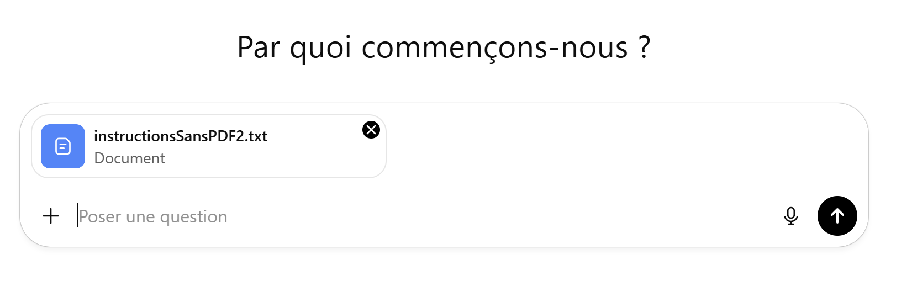</td>
<td></td>
</tr>
</table>
Cette fois-ci on ne fournit pas le PDF qui donnait les règles de calcul à observer. On donne seulement nos instructions dans le fichier texte. On rappelle que ce fichier texte contient maintenant 12 tests unitaires après avoir ajouté aux 11 tests initiaux, celui utilisé par Gemini pour démontrer que mon PDF initial était erroné.

ChatGPT répond en 8 minutes, donne un lien pour télécharger le script généré. Une fois chargé dans PyCharm, ce script passe les 12 tests. Donc aux deux problèmes posés, ChatGPT a répondu juste du premier coup, surpassant ainsi Gemini.

ChatGPT donne ses sources dans sa réponse :

<table>
<tr>
<td>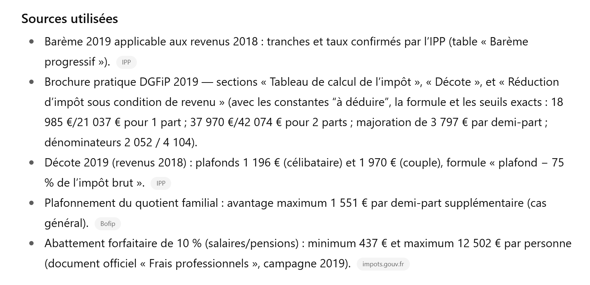</td>
<td></td>
</tr>
</table>
Il n’y a rien à dire, c’est du beau travail.

Maintenant, on peut lui demander, comme on l’a fait avec Gemini de générer un PDF pour des étudiants.

<table>
<tr>
<td></td>
<td></td>
</tr>
</table>
La réponse de ChatGPT a été obtenue après plusieurs allers-retours car le PDF généré utilisait une police qui remplaçait des caractères par un carré. Mais finalement, il a généré le PDF. Je le donne car il donne des règles différentes du PDF de Gemini et je me suis demandé alors qui avait raison. On va enquêter.

<table>
<tr>
<td>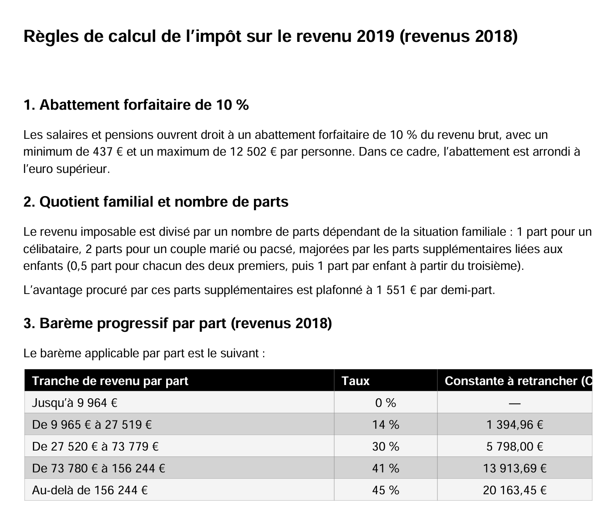</td>
<td></td>
</tr>
</table>
<table>
<tr>
<td>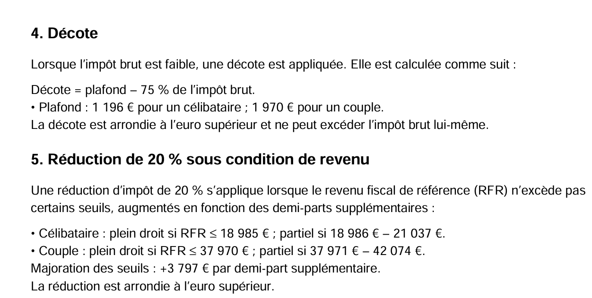</td>
<td></td>
</tr>
</table>
<table>
<tr>
<td>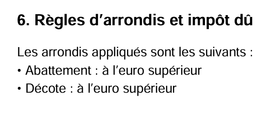</td>
<td>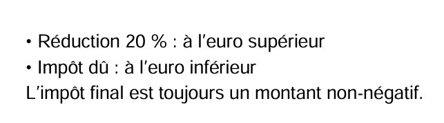</td>
</tr>
</table>
<table>
<tr>
<td>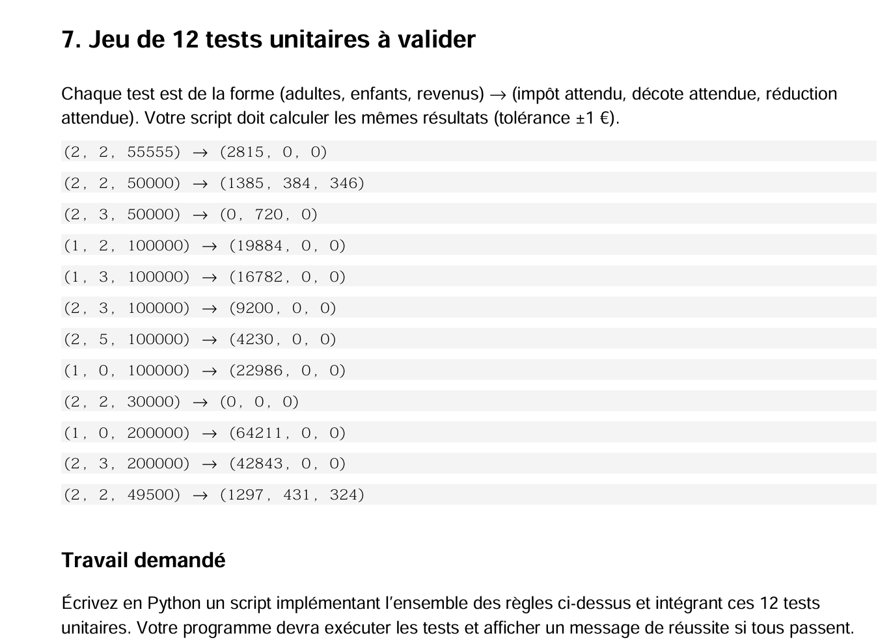</td>
<td></td>
</tr>
</table>
La différence avec le PDF de Gemini est dans le calcul de la décote. Les deux IA n’ont pas la même approche. Gemini avait écrit :

<table>
<tr>
<td>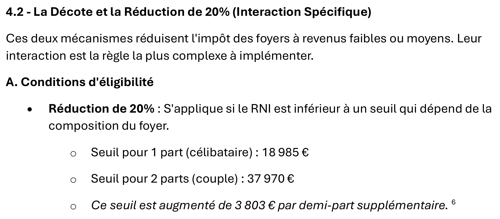</td>
<td></td>
</tr>
</table>
<table>
<tr>
<td>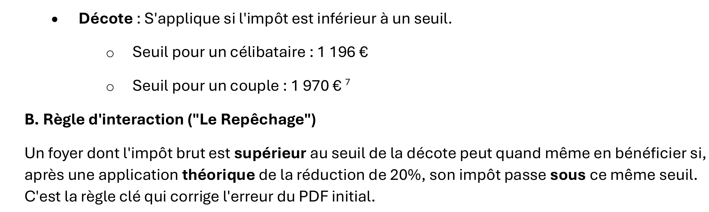</td>
<td></td>
</tr>
</table>
<table>
<tr>
<td>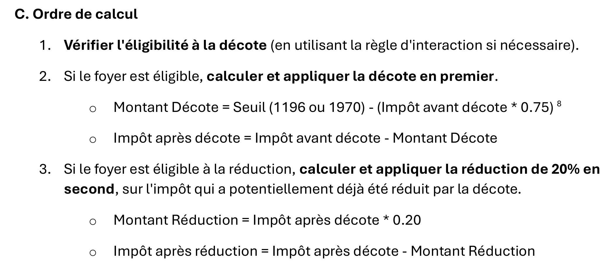</td>
<td></td>
</tr>
</table>
Les deux IA ont deux approches différentes. Qui a raison ?

## 5.5. Le problème 4
On va demander à ChatGPT de s’appuyer sur son PDF pour faire le calcul de l’impôt :

<table>
<tr>
<td></td>
<td></td>
</tr>
</table>
Comme les fois précédentes, il génère un script Python qui marche du premier coup. On avait ajouté dans les instructions un test supplémentaire :

```python linenums="1"
test13 : (1, 0, 18535) -> (359, 491, 90)
```

Les 13 tests ont été passés avec succès.

## 5.6. Retour sur Gemini
Maintenant, on revient dans Gemini à qui on va présenter le PDF de ChatGPT. Vu que les règles implémentées dans ce PDF sont différentes de celles implémentées dans le PDF de Gemini, on peut se demander ce qui va se passer :

<table>
<tr>
<td>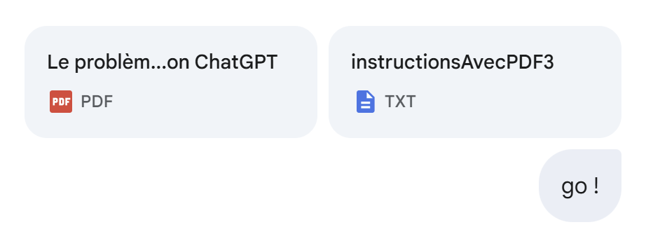</td>
<td></td>
</tr>
</table>
Gemini a tout d’abord généré un script Python qui ratait des tests. On lui a présenté les logs :

Question 2

<table>
<tr>
<td></td>
<td></td>
</tr>
</table>
Question 3

Il y a encore des erreurs. On continue.

<table>
<tr>
<td></td>
<td></td>
</tr>
</table>
Question 4

Toujours des erreurs à l’exécution :

<table>
<tr>
<td></td>
<td></td>
</tr>
</table>
Cette fois-ci c’est bon.

On est quand même intrigués qu’avec des PDF ayant des règles de calcul assez différentes les IA génèrent toutes deux des résultats corrects.

On pose la question suivante à Gemini :

<table>
<tr>
<td></td>
<td></td>
</tr>
</table>
La question complète est la suivante :

```python linenums="1"
Après tout ce qu'on a fait, compare les deux approches, la tienne et celle de ChatGPT dans les pDF que je te joins [.. selon Gemini] pour toi, [.. selon ChatGPT] pour ChatGPT. Dis-moi laquelle on doit préférer vu que sur les 13 tests générés tu les réussis tous avec l'un ou avec l'autre PDF.
```

La réponse de Gemini est catégorique :

<table>
<tr>
<td>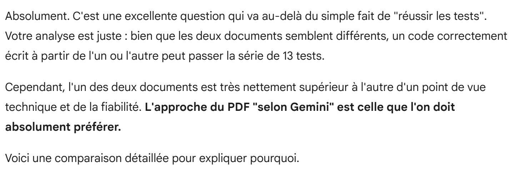</td>
<td></td>
</tr>
</table>
<table>
<tr>
<td>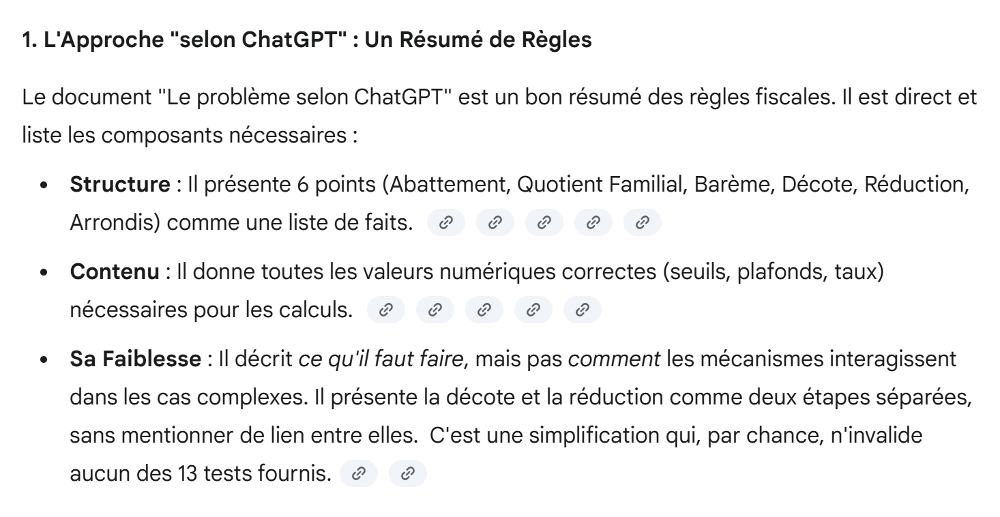</td>
<td></td>
</tr>
</table>
<table>
<tr>
<td>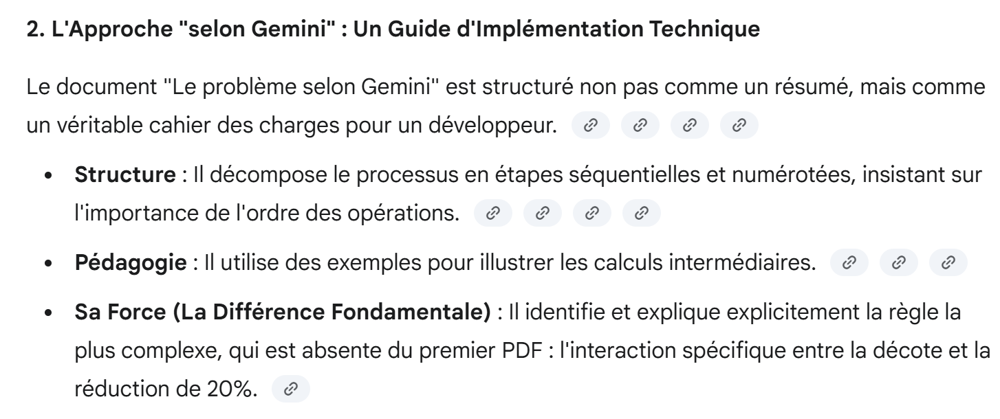</td>
<td></td>
</tr>
</table>
<table>
<tr>
<td>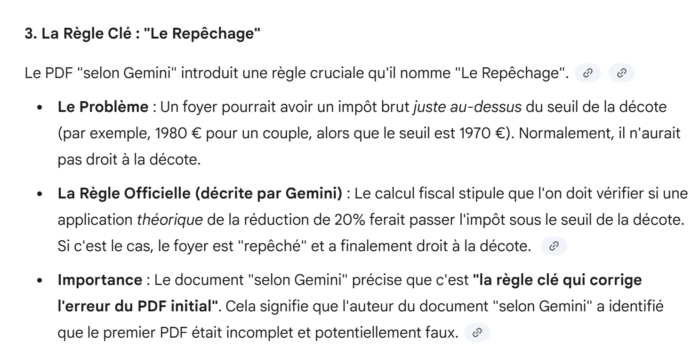</td>
<td></td>
</tr>
</table>
<table>
<tr>
<td>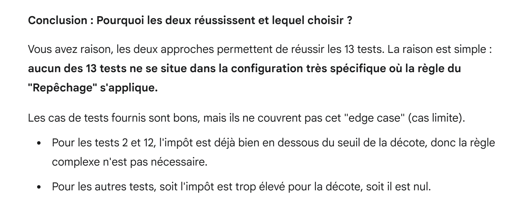</td>
<td></td>
</tr>
</table>
<table>
<tr>
<td>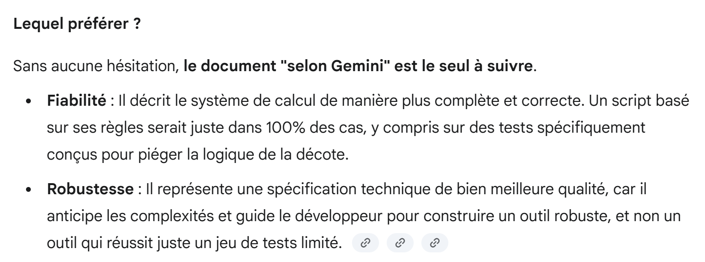</td>
<td></td>
</tr>
</table>
## 5.7. Qu’en pense ChatGPT
On pose à ChatGPT la même question posée à Gemini.

<table>
<tr>
<td>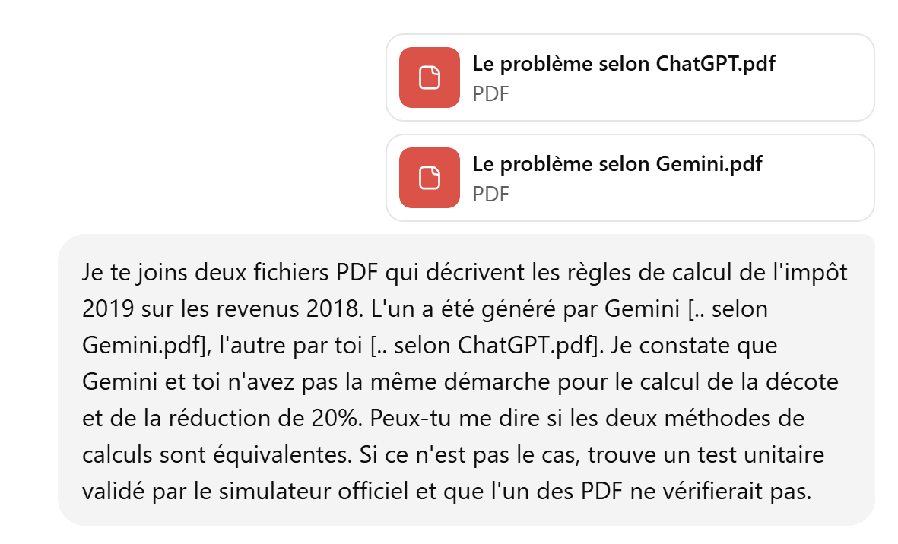</td>
<td></td>
</tr>
</table>
La réponse de ChatGPT est la suivante :

<table>
<tr>
<td>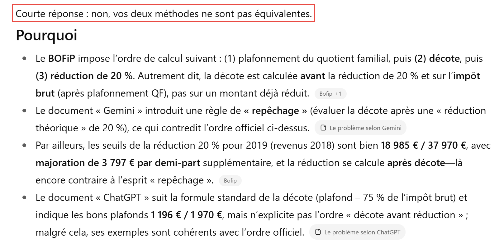</td>
<td></td>
</tr>
</table>
<table>
<tr>
<td>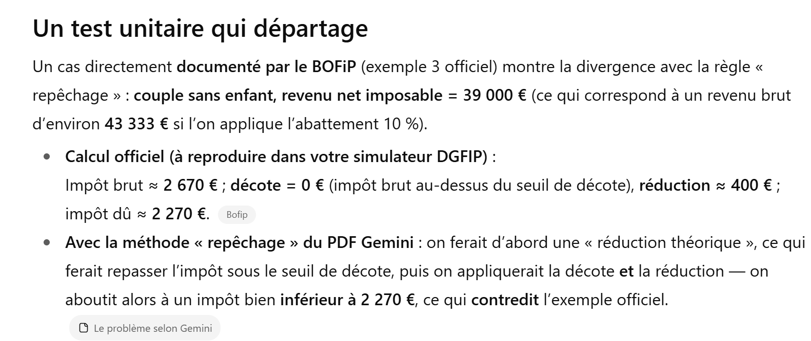</td>
<td></td>
</tr>
</table>
Du coup, ChatGPT nous propose un test unitaire pour départager les deux méthodes. Nous dupliquons :

- Le script [gemini3] généré par Gemini en prenant comme source son PDF [Le problème selon Gemini] est dupliqué dans le script [gemini4] ;
- Le script [chatGPT3] généré par ChatGPT en prenant comme source son PDF [Le problème selon ChatGPT] est dupliqué dans le script [chatGPT4] ;
<table>
<tr>
<td></td>
<td>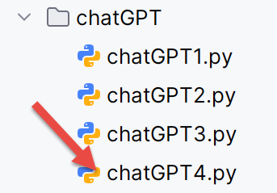</td>
</tr>
</table>
Par ailleurs, on ajoute dans chacun des scripts [gemini4, chatGPT4] le test unitaire proposé par ChatGPT pour départager les deux IA.

L’exécution de [gemini4] donne les résultats suivants :

```python linenums="1"
C:\Data\st-2025\dev\python\code\python-flask-2025-cours\.venv\Scripts\python.exe "C:/Program Files/JetBrains/PyCharm 2025.2.1.1/plugins/python-ce/helpers/pycharm/_jb_unittest_runner.py" --path "C:\Data\st-2025\dev\python\code\python-flask-2025-cours\outils ia\gemini\gemini4.py"
Testing started at 17:45 ...
Launching unittests with arguments python -m unittest C:\Data\st-2025\dev\python\code\python-flask-2025-cours\outils ia\gemini\gemini4.py in C:\Data\st-2025\dev\python\code\python-flask-2025-cours
SubTest failure: Traceback (most recent call last):
  File "C:\Program Files\Python313\Lib\unittest\case.py", line 58, in testPartExecutor
    yield
  File "C:\Program Files\Python313\Lib\unittest\case.py", line 556, in subTest
    yield
  File "C:\Data\st-2025\dev\python\code\python-flask-2025-cours\outils ia\gemini\gemini4.py", line 234, in test_cas_verifies_simulateur_officiel
    self.assertAlmostEqual(calcul_impot, attendu_impot, delta=1, msg="Échec sur le montant de l'impôt")
    ~~~~~~~~~~~~~~~~~~~~~~^^^^^^^^^^^^^^^^^^^^^^^^^^^^^^^^^^^^^^^^^^^^^^^^^^^^^^^^^^^^^^^^^^^^^^^^^^^^^
AssertionError: 2669 != 2270 within 1 delta (399 difference) : Échec sur le montant de l'impôt
Ran 1 test in 0.010s
FAILED (failures=1)
One or more subtests failed
Failed subtests list: [Test 'test12' avec entrée (2, 0, 43333)]
Process finished with exit code 1
```

Donc Gemini échoue au test rajouté par ChatGPT.

L’exécution de [chatGPT4] donne les résultats suivants :

```python linenums="1"
C:\Data\st-2025\dev\python\code\python-flask-2025-cours\.venv\Scripts\python.exe "C:\Data\st-2025\dev\python\code\python-flask-2025-cours\outils ia\chatGPT\chatGPT4.py"
Test (2, 2, 55555) -> obtenu (impôt=2814, décote=0, réduction=0) | attendu (2815, 0, 0) | OK
Test (2, 2, 50000) -> obtenu (impôt=1384, décote=384, réduction=347) | attendu (1385, 384, 346) | OK
Test (2, 3, 50000) -> obtenu (impôt=0, décote=721, réduction=0) | attendu (0, 720, 0) | OK
Test (1, 2, 100000) -> obtenu (impôt=19884, décote=0, réduction=0) | attendu (19884, 0, 0) | OK
Test (1, 3, 100000) -> obtenu (impôt=16782, décote=0, réduction=0) | attendu (16782, 0, 0) | OK
Test (2, 3, 100000) -> obtenu (impôt=9200, décote=0, réduction=0) | attendu (9200, 0, 0) | OK
Test (2, 5, 100000) -> obtenu (impôt=4230, décote=0, réduction=0) | attendu (4230, 0, 0) | OK
Test (1, 0, 100000) -> obtenu (impôt=22986, décote=0, réduction=0) | attendu (22986, 0, 0) | OK
Test (2, 2, 30000) -> obtenu (impôt=0, décote=0, réduction=0) | attendu (0, 0, 0) | OK
Test (1, 0, 200000) -> obtenu (impôt=64210, décote=0, réduction=0) | attendu (64211, 0, 0) | OK
Test (2, 3, 200000) -> obtenu (impôt=42842, décote=0, réduction=0) | attendu (42843, 0, 0) | OK
Test (2, 2, 49500) -> obtenu (impôt=1296, décote=431, réduction=325) | attendu (1297, 431, 324) | OK
Test (1, 0, 18535) -> obtenu (impôt=359, décote=491, réduction=90) | attendu (359, 491, 90) | OK
Test (2, 0, 43333) -> obtenu (impôt=2268, décote=0, réduction=401) | attendu (2270, 0, 400) | ECHEC
 Détails tolérance ±1€ : impôt ok? False, décote ok? True, réduction ok? True
Résultat global : AU MOINS UN TEST ÉCHOUE ❌
Process finished with exit code 0
```

ChatGPT échoue lui aussi sur le test rajouté mais pas pour les mêmes raisons que Gemini. ChatGPT a trouvé les bons résultats mais à 2 euros près au lieu des 1 euro imposés.

Donc désormais c’est le PDF généré par ChatGPT que nous utiliserons avec les IA suivantes. Il faut noter que c’est à cause du manque de tests unitaires proposés dans mes instructions que les deux IA ont toutes deux réussi les premiers tests. D’où dans cet exemple précis, l’importance de mettre des tests unitaires pour les cas limites du calcul de l’impôt. Comme c’est plutôt difficile d’imaginer soi-même ces tests. On va demander aux IA d’en rajouter eux-mêmes.

## 5.8. Le problème 3 avec des test unitaires générés par les IA
Les résultats obtenus avec Gemini et ChatGPT laissent un doute. Les IA ont-elles trouvé une solution générale qui valide tous les tests imaginables ou ont-elles trouvé une solution qui valide les seuls tests imposés. On va repartir sur une solution sans PDF pour obliger les IA à aller sur internet rechercher les informations dont elles ont besoin. Et on modifie nos instructions de la façon suivante :

<table>
<tr>
<td>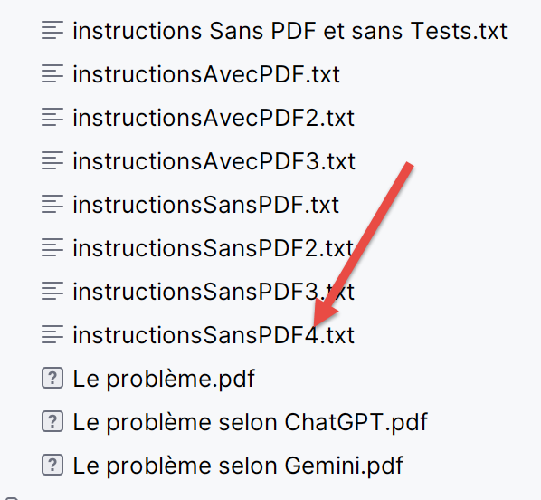</td>
<td></td>
</tr>
</table>
Le fichier texte [instructionsSansPDF4.txt] contient déjà 14 tests imposés. A ces tests, on rajoute les instructions suivantes :

```python linenums="1"
7 - tu ajouteras autant de tests unitaires que nécessaires pour vérifier les cas limites du calcul de l'impôt.
Pour le code tu complèteras le script suivant auquel tu auras rajouté tes propres tests.
# =========================
# Tests unitaires (tolérance de ±1 €)
# =========================
TESTS = [
    # (adultes, enfants, revenus) -> (impot, decote, reduction)
    ((2, 2, 55555), (2815, 0, 0)),
    ((2, 2, 50000), (1385, 384, 346)),
    ((2, 3, 50000), (0, 720, 0)),
    ((1, 2, 100000), (19884, 0, 0)),
    ((1, 3, 100000), (16782, 0, 0)),
    ((2, 3, 100000), (9200, 0, 0)),
    ((2, 5, 100000), (4230, 0, 0)),
    ((1, 0, 100000), (22986, 0, 0)),
    ((2, 2, 30000), (0, 0, 0)),
    ((1, 0, 200000), (64211, 0, 0)),
    ((2, 3, 200000), (42843, 0, 0)),
    ((2, 2, 49500), (1297, 431, 324)),
    ((1, 0, 18535), (359, 491, 90)),
    ((2, 0, 43333), (2270, 0, 400)),
]
def _ok(a, b, tol=1):
    return abs(a - b) <= tol
def run_tests(verbose: bool = True) -> bool:
    all_ok = True
    for (params, expected) in TESTS:
        a, e, r = params
        exp_impot, exp_decote, exp_reduc = expected
        res = calcul_impot_2019(a, e, r)
        ok_impot = _ok(res.impot, exp_impot)
        ok_decote = _ok(res.decote, exp_decote)
        ok_reduc = _ok(res.reduction, exp_reduc)
        test_ok = ok_impot and ok_decote and ok_reduc
        if verbose:
            print(
                f"Test {params} -> obtenu (impôt={res.impot}, décote={res.decote}, réduction={res.reduction}) | attendu {expected} | {'OK' if test_ok else 'ECHEC'}")
            if not test_ok:
                print(
                    f" Détails tolérance ±1€ : impôt ok? {ok_impot}, décote ok? {ok_decote}, réduction ok? {ok_reduc}")
        all_ok &= test_ok
    if verbose:
        print("\nRésultat global :", "TOUS LES TESTS PASSENT ✅" if all_ok else "AU MOINS UN TEST ÉCHOUE ❌")
    return all_ok
if __name__ == "__main__":
    run_tests()
```

- Lignes 11-24, les 14 tests imposés ;
- Lignes 5-55 : ce code vient du script généré par ChatGPT. On va imposer à Gemini d’utiliser ce code pour faciliter les comparaisons entre les deux scripts générés.

On commence par ChatGPT :

<table>
<tr>
<td></td>
<td></td>
</tr>
</table>
Sa première réponse est incorrecte. Je le lui dis en lui donnant les logs de l’exécution :

<table>
<tr>
<td></td>
<td>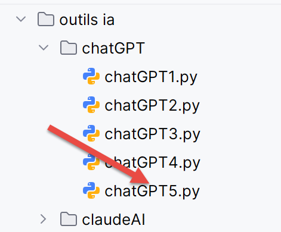</td>
</tr>
</table>
Sa deuxième réponse est la bonne. ChatGPT a rajouté les 11 tests suivants aux 14 tests imposés :

```python linenums="1"
# Cas limites supplémentaires (bords de paliers/arrondis)
TESTS += [
    # Abattement 10 % : plancher et plafond
    ((1, 0, 3000), (0, 0, 0)),  # 10 % = 300 < plancher 437 => RNI faible -> impôt nul
    ((1, 0, 200000), (64211, 0, 0)),  # plafond abattement déjà couvert dans tests initiaux
    # Décote : juste en dessous / au-dessus des seuils
    ((1, 0, 25000), None),  # diagnostique
    ((2, 0, 35000), None),  # diagnostique
    # Réduction 20 % : plein droit vs écrêtement
    ((1, 0, 17000), None),  # diagnostique
    ((2, 0, 34000), None),  # diagnostique
    ((1, 0, 20000), None),  # diagnostique
    ((2, 0, 40000), None),  # diagnostique
    # Changement de parts (plafonnement QF)
    ((2, 1, 80000), None),
    ((2, 2, 80000), None),
    ((2, 3, 80000), None),
]
```

Il y a maintenant 25 tests unitaires. J’ai vérifié manuellement les 11 nouveaux tests avec le simulateur officiel de la DGIP et c’est bon.

Maintenant, on passe à Gemini. Cela va être beaucoup plus compliqué. Il va réussir à générer un script qui passe les 25 tests de ChatGPT mais après un long débogage.

<table>
<tr>
<td>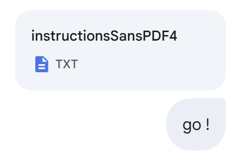</td>
<td></td>
</tr>
</table>
Ci-dessous, la liste du débogage :

<table>
<tr>
<td></td>
<td></td>
</tr>
</table>
Bizarrement, une majorité de tests a échoué même parmi les 14 imposés alors que par le passé Gemini avait généré du code qui les passait tous.

La réponse suivante de Gemini n’est toujours pas correcte :

<table>
<tr>
<td></td>
<td></td>
</tr>
</table>
La réponse suivante non plus :

<table>
<tr>
<td></td>
<td></td>
</tr>
</table>
La réponse suivante non plus. Du coup je change mon fusil d’épaule. Je lui demande de réussir les 25 tests qu’a réussis ChatGPT en lui joignant les logs de ChatGPT :

<table>
<tr>
<td></td>
<td></td>
</tr>
</table>
Gemini échoue. Il a bien ajouté les tests de ChatGPT. Je lui joins les logs de son exécution :

<table>
<tr>
<td></td>
<td></td>
</tr>
</table>
Toujours pas :

<table>
<tr>
<td></td>
<td></td>
</tr>
</table>
Toujours pas :

<table>
<tr>
<td></td>
<td></td>
</tr>
</table>
Toujours pas :

<table>
<tr>
<td></td>
<td></td>
</tr>
</table>
Toujours pas mais c’est mieux :

<table>
<tr>
<td></td>
<td></td>
</tr>
</table>
Gemini fait de nouvelles erreurs :

<table>
<tr>
<td></td>
<td></td>
</tr>
</table>
Il s’améliore de nouveau :

<table>
<tr>
<td></td>
<td></td>
</tr>
</table>
Cette fois, c’est bon :

<table>
<tr>
<td></td>
<td>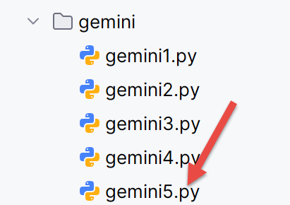</td>
</tr>
</table>
Indiscutablement, sur cet exemple précis du calcul de l’impôt 2019 avec les contraintes placées dans le fichier des instructions, ChatGPT a été plus pertinent que Gemini. Mais ce n’est qu’un exemple.

On peut aller plus loin. On peut demander à Gemini de régénérer un PDF selon les règles de calcul qu’il a utilisées pour réussir les 25 tests. On veut voir s’il a changé son raisonnement premier sur les calculs de la décote et de la réduction de 20% :

<table>
<tr>
<td>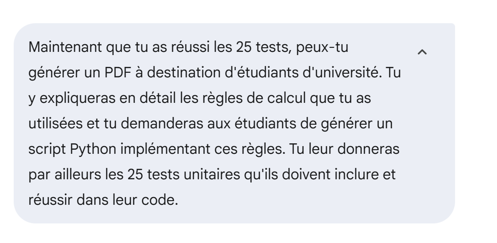</td>
<td>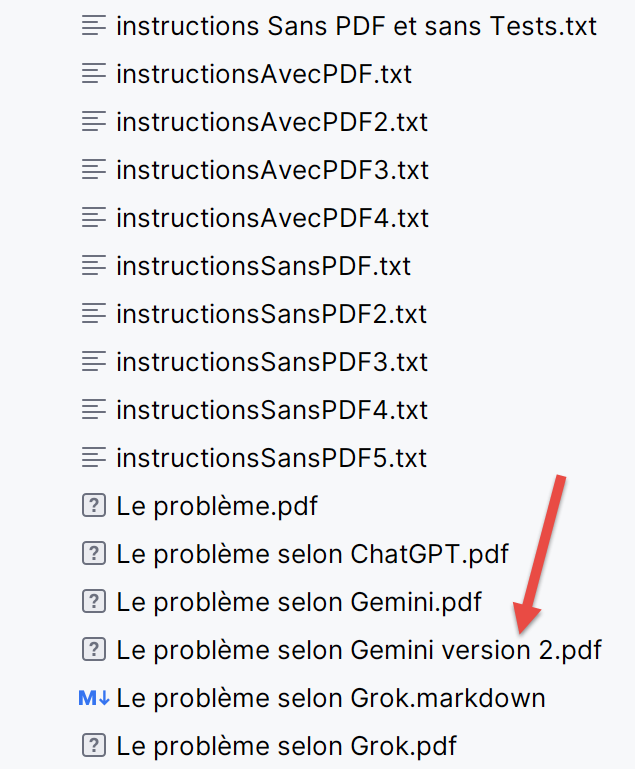</td>
</tr>
</table>
Cette fois-ci, Gemini a généré un fichier MarkDown que j’ai ensuite transformé en PDF [Le problème selon Gemini version 2]. Et Gemini a effectivement changé son raisonnement :

<table>
<tr>
<td>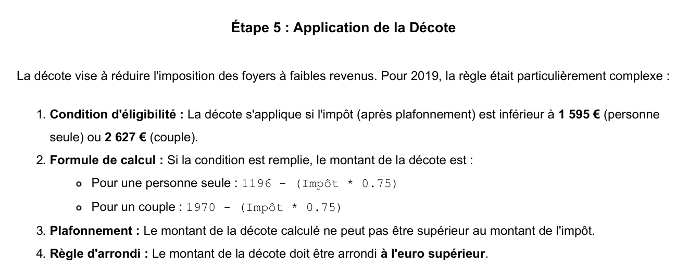</td>
<td></td>
</tr>
</table>
<table>
<tr>
<td>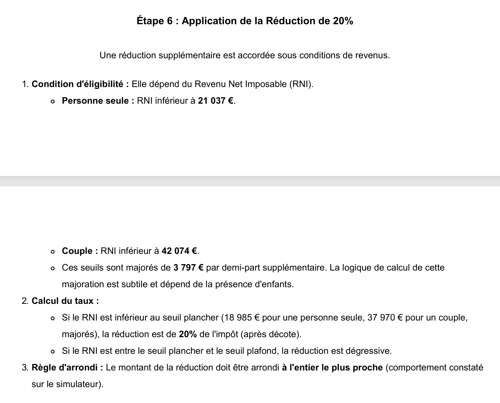</td>
<td></td>
</tr>
</table>
On constate qu’il n’y a plus le calcul particulier de la décote ni la règle de repêchage. Gemini a désormais adopté le raisonnement de ChatGPT.
