# 7. Résolution des trois problèmes avec ClaudeAI
## 7.1. Introduction
<table>
<tr>
<td>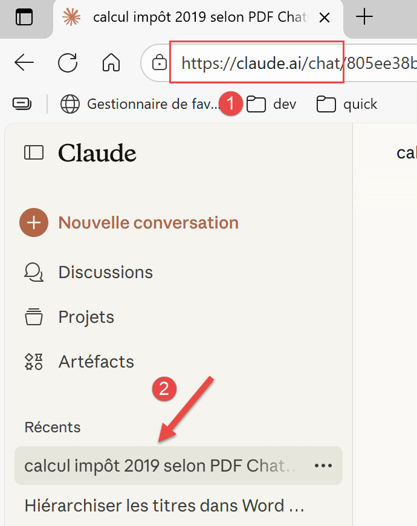</td>
<td>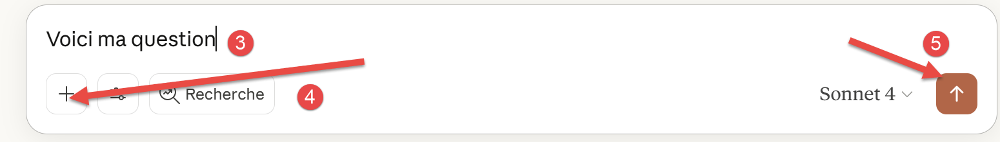</td>
</tr>
</table>
- En [1], l’URL de l’IA ClaudeAI [https://claude.ai/chat] produit de l’entreprise Anthropic [https://www.anthropic.com/] ;
- En [2], l’historique de vos chats. Les sessions gratuites de ClaudeAI sont très limitées. J’ai pris un abonnement payant d’un mois pour faire les tests qui suivent ;
- En [3], votre question ;
- En [4], pour joindre des fichiers à votre question ;
- En [5], pour exécuter votre question ;
## 7.2. Le problème 1
La question :

<table>
<tr>
<td>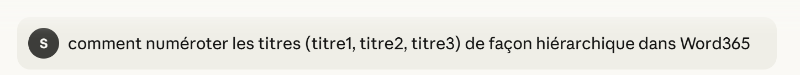</td>
<td></td>
</tr>
</table>
ClaudeAI répond correctement.

## 7.3. Le problème 2
La question :

<table>
<tr>
<td>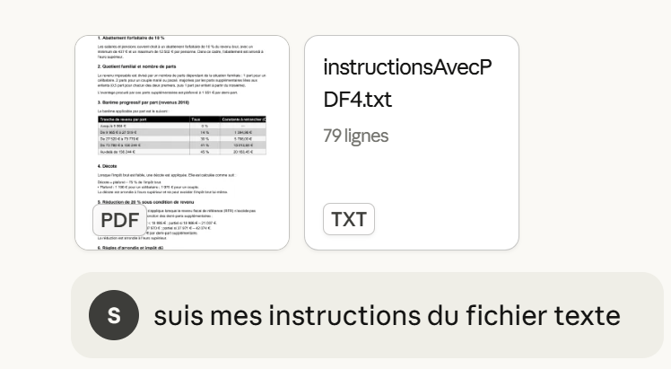</td>
<td></td>
</tr>
</table>
J’ai joint deux fichiers à ma question :

- Le PDF généré par ChatGPT [Le problème selon ChatGPT.pdf] ;
- Mes instructions dans le fichier texte [InstructionsAvecPDF4.txt]. C’est celui qui impose les 25 tests unitaires proposés par ChatGPT ;

La première réponse est incorrecte. On donne les logs de l’exécution :

<table>
<tr>
<td>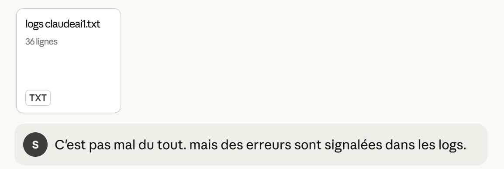</td>
<td>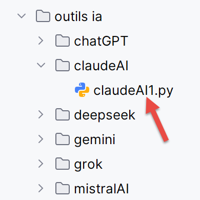</td>
</tr>
</table>
La réponse comporte encore une erreur mais minime. ClaudeAI rate un test à 2 euros près alors que la précision demandée aux tests est de 1 euro. En fait, en leur temps, aussi bien Gemini que ChatGPT avaient raté ce test pour la même raison. Il est probable que la contrainte à 1 euro près est trop forte à cause des problèmes d’arrondis dont on ne connaît pas les règles officielles.

Toujours est-il qu’après deux aller / retour supplémentaires, ClaudeAI donne la bonne solution.

## 7.4. Le problème 3
La question :

<table>
<tr>
<td>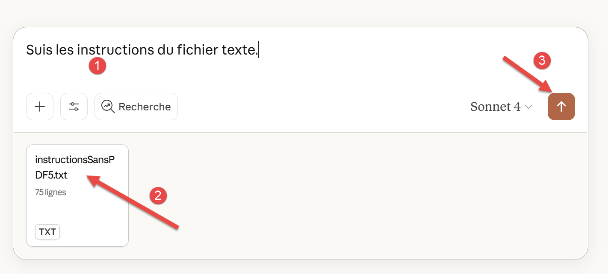</td>
<td></td>
</tr>
</table>
En [2], on a joint un fichier texte déjà utilisé avec les IA précédentes. Il oblige l’IA à chercher ses informations sur internet et impose là encore les 25 tests unitaires.

La première réponse a beaucoup d’erreurs. On transmet les logs à l’IA :

<table>
<tr>
<td>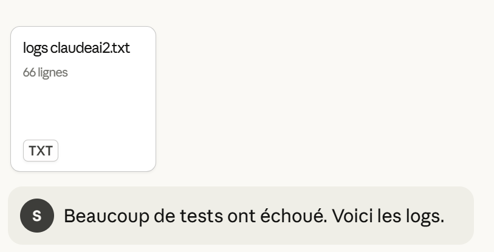</td>
<td></td>
</tr>
</table>
Encore des erreurs :

<table>
<tr>
<td>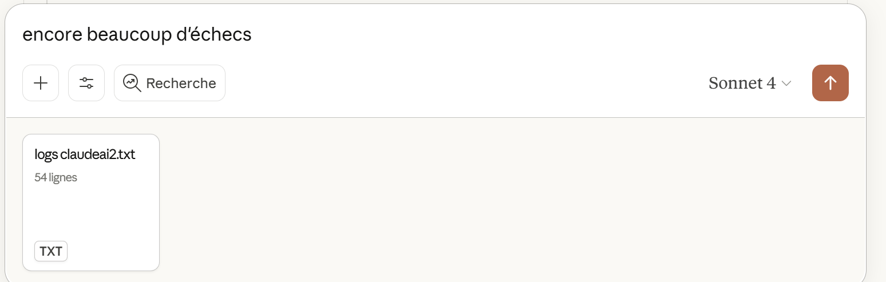</td>
<td></td>
</tr>
</table>
Toujours pas. On l’encourage :

<table>
<tr>
<td>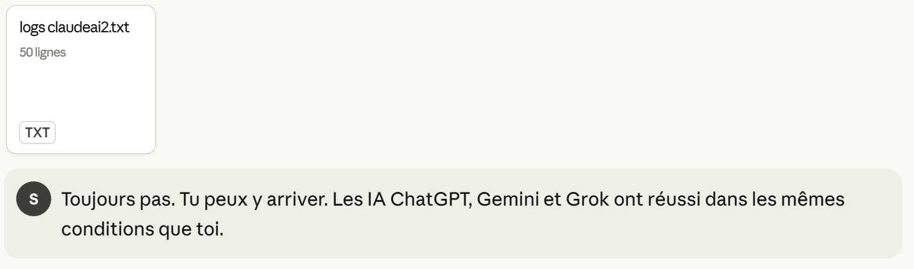</td>
<td></td>
</tr>
</table>
Toujours pas :

<table>
<tr>
<td>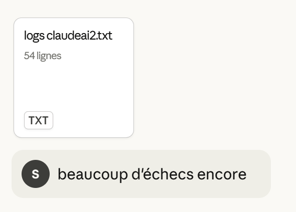</td>
<td></td>
</tr>
</table>
Toujours pas :

<table>
<tr>
<td>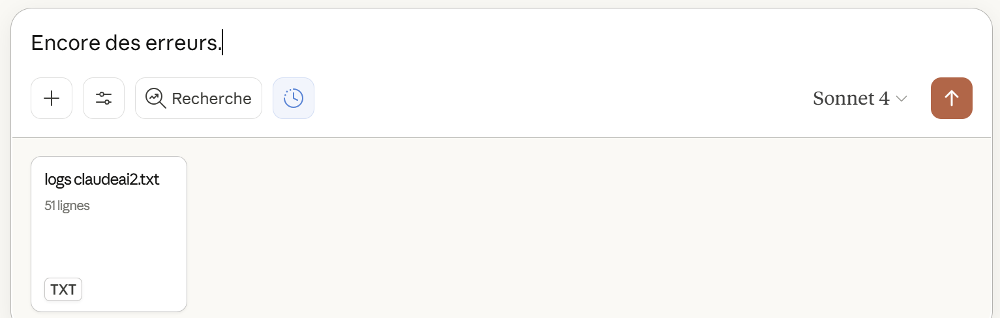</td>
<td></td>
</tr>
</table>
Rien à faire :

<table>
<tr>
<td>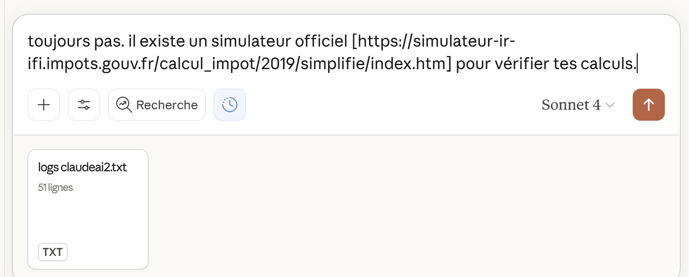</td>
<td></td>
</tr>
</table>
Encore beaucoup d’échecs. On va considérer que ClaudeAI n’a pas su résoudre le problème 3 dans un délai raisonnable.
