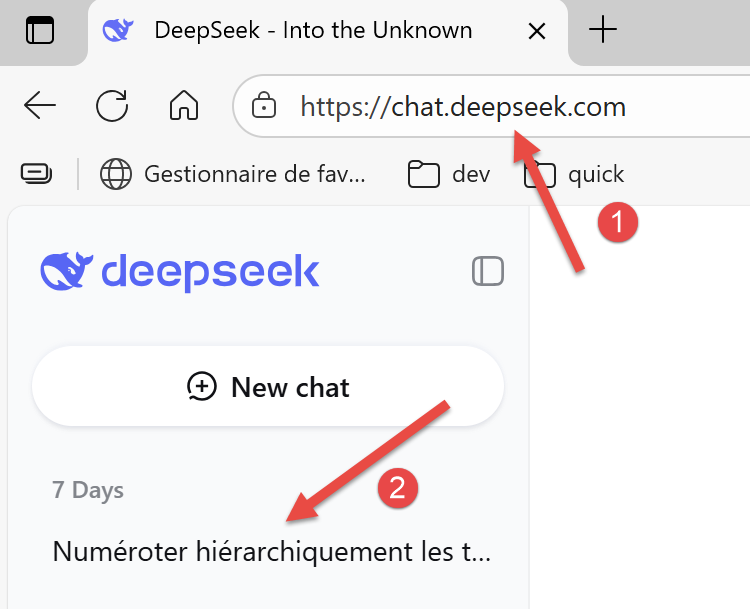
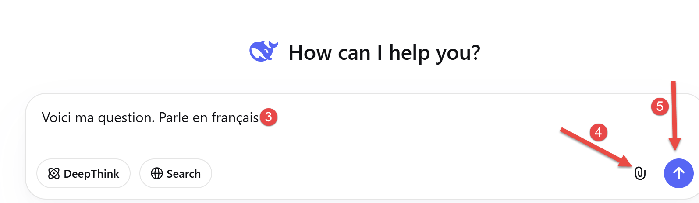
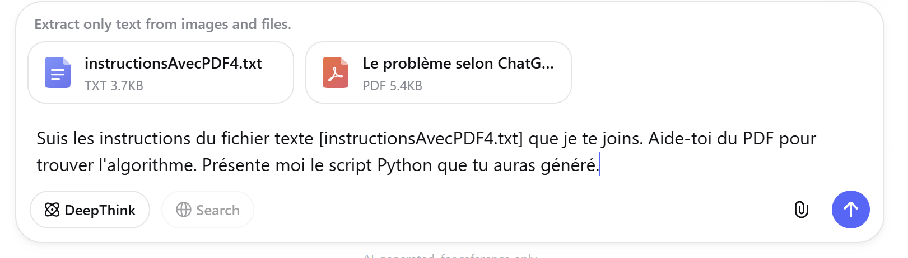
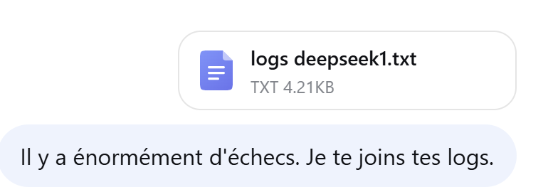
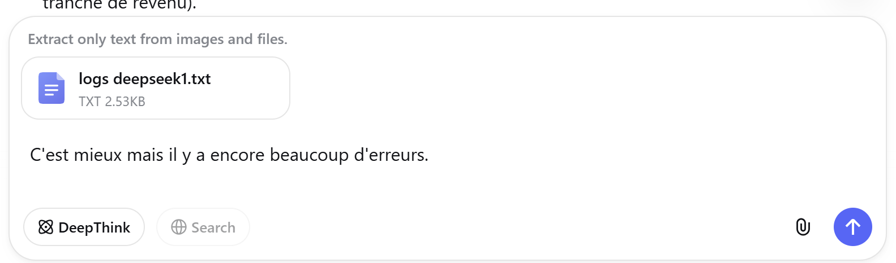
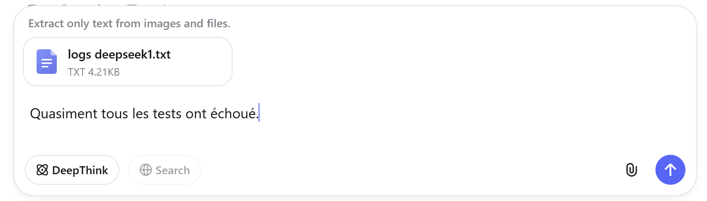
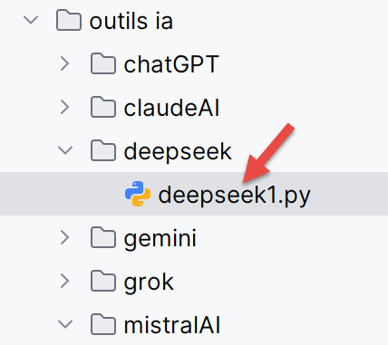
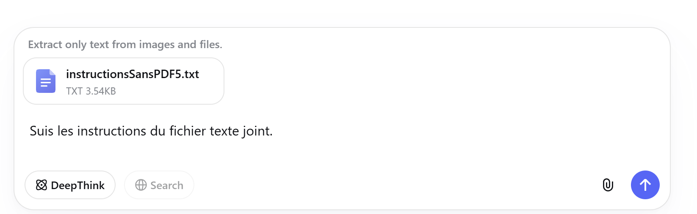
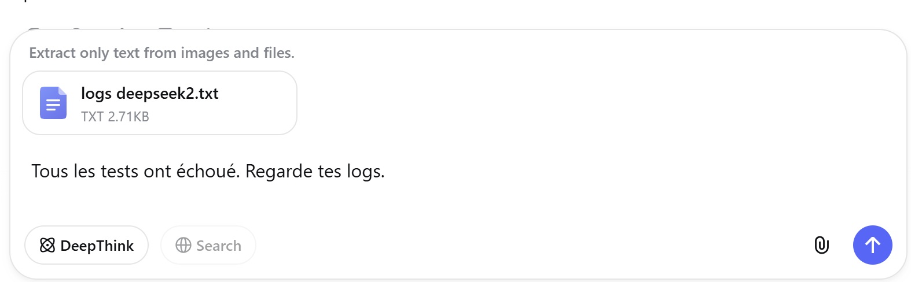
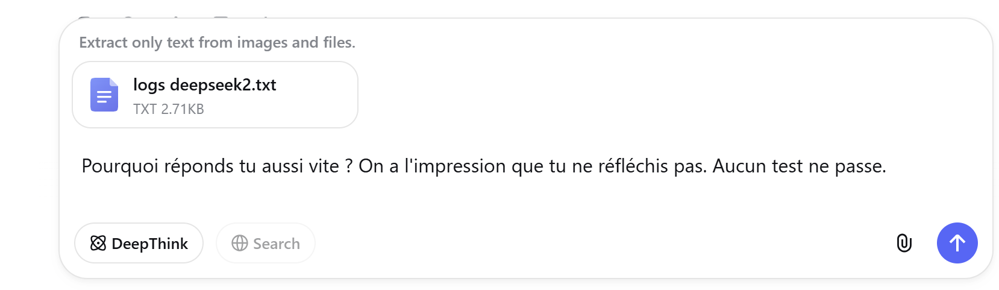

# 9. Résolution des trois problèmes avec DeepSeek
## 9.1. Introduction
<table>
<tr>
<td></td>
<td></td>
</tr>
</table>
- En [1], l’URL de DeepSeek [https://chat.deepseek.com/] ;
- En [2], votre historique. Pour l’avoir il faut vous créer un compte (gratuit en sept. 2025) ;
- En [3], votre question ;
- En [4], pour joindre des fichiers à votre question ;
- En [5], pour exécuter votre question ;
## 9.2. Le problème 1
La question :

<table>
<tr>
<td></td>
<td></td>
</tr>
</table>
La réponse de DeepSeek laisse à désirer. Elle est moins précise que celles générées par les autres IA.

## 9.3. Le problème 2
La question :

<table>
<tr>
<td></td>
<td></td>
</tr>
</table>
La première réponse est incorrecte. On relance :

<table>
<tr>
<td></td>
<td></td>
</tr>
</table>
La réponse suivante est un peu meilleure :

<table>
<tr>
<td></td>
<td></td>
</tr>
</table>
La réponse suivante est très décevante. Quasiment tous les tests échouent. Dans les réponses de DeepSeek, on ne sent pas la certitude des premières IA testées. On dirait que l’IA doute elle-même de l’exactitude de ses réponses. Par ailleurs, on a l’impression que DeepSeek ne réfléchit pas. Elle donne une réponse très rapidement alors que ChatGPT mettait des minutes à réfléchir. Peut-être un problème de configuration.

<table>
<tr>
<td></td>
<td></td>
</tr>
</table>
Cette fois-ci c’est mieux. Il ne reste plus qu’un échec à 2 euros près. D’autres IA ont chuté sur ce même test avec ces mêmes deux euros d’écart. On va considérer que le script de DeepSeek est correct.

## 9.4. Le problème 3
La question

<table>
<tr>
<td></td>
<td></td>
</tr>
</table>
Cette fois, plus de PDF. DeepSeek va devoir chercher les règles de calcul sur internet.

Première réponse : les 25 tests échouent. On recommence.

<table>
<tr>
<td></td>
<td></td>
</tr>
</table>
Les 25 tests échouent de nouveau.

<table>
<tr>
<td></td>
<td></td>
</tr>
</table>
De nouveau, 25 tests échoués. On abandonne et on considère que DeepSeek n’a pas su résoudre le problème 3 dans un temps raisonnable.
