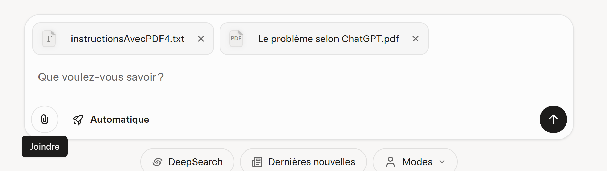
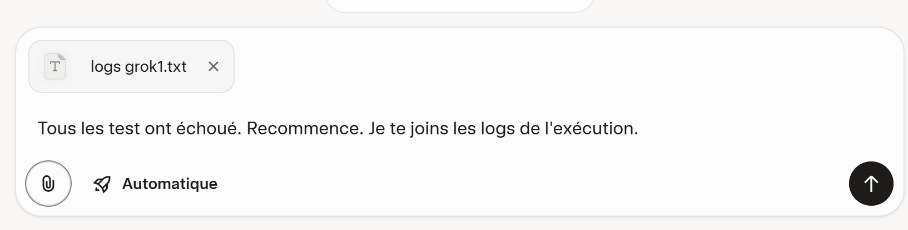
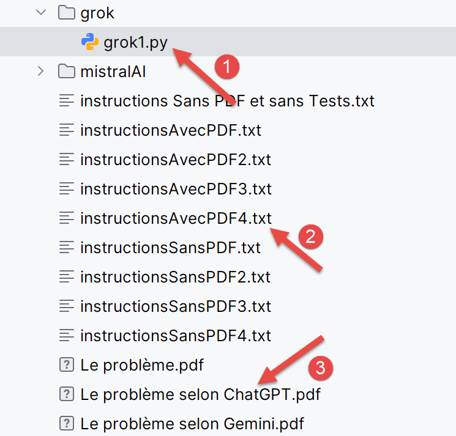
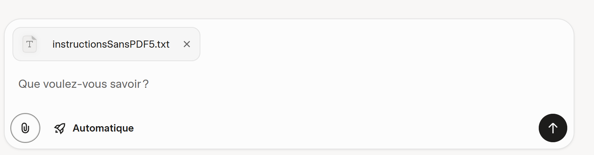
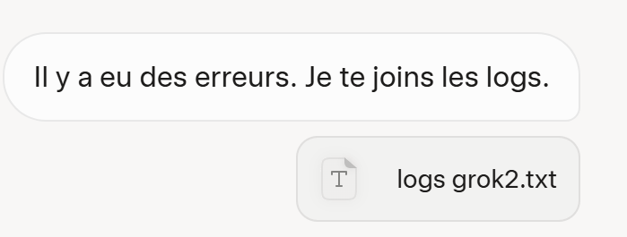
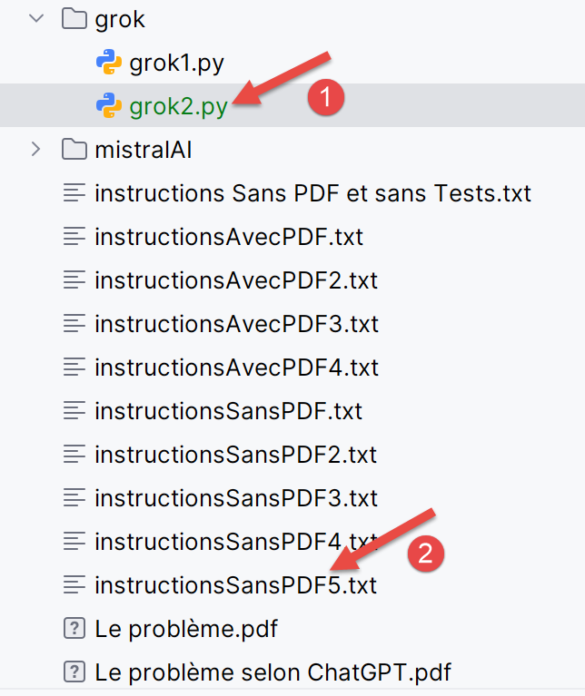
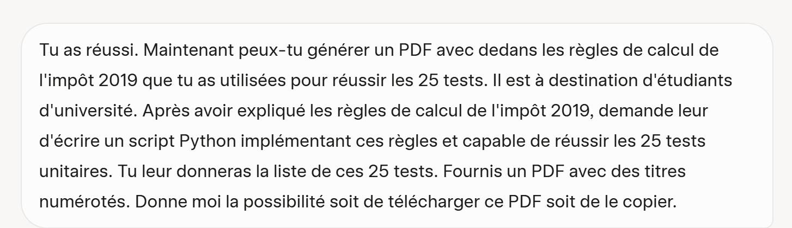
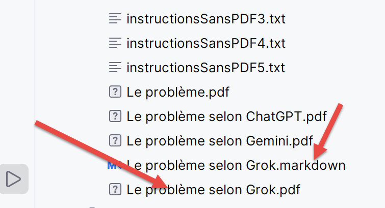
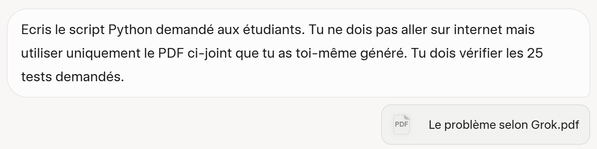

# 6. Résolution des trois problèmes avec Grok
## 6.1. Introduction
<table>
<tr>
<td></td>
<td></td>
</tr>
</table>
- En [1], l’URL de l’IA Grok propriété de l’entreprise xAI [https://x.ai/company] ;
- En [2], l’historique de vos conversations. Pour l’avoir, il faut vous créer un compte ;
- En [3], posez votre question ;
- En [4], vous pouvez joindre des fichiers ;
- En [5], vous lancez l’exécution de l’IA ;

Contrairement à Gemini et ChatGPT, je n’ai pas rencontré de limites de questions, de temps ou de nombre de fichiers joints. Cela ne veut pas dire que ces limites n’existent pas.

## 6.2. Le problème 1
<table>
<tr>
<td></td>
<td></td>
</tr>
</table>
Grok répond correctement à cette question.

## 6.3. Le problème 2
On propose à Grok de résoudre le calcul de l’impôt à l’aide du PDF généré par ChatGPT et on lui donne nos instructions dans un fichier texte.

<table>
<tr>
<td></td>
<td></td>
</tr>
</table>
Le fichier texte est celui déjà utilisé avec les deux IA testées, mais on y a mis les 25 tests validés par ChatGPT et Gemini. Le PDF utilisé est celui généré par ChatGPT :

Grok fournit alors un script très propre mais porté dans PyCharm, pratiquement aucun test ne passe. Je lui fournis alors les logs de ses erreurs :

<table>
<tr>
<td></td>
<td></td>
</tr>
</table>
Cette fois-ci, Grok réussit les 25 tests. En [1-3], on montre le script [grok1] généré ainsi que les deux fichiers joints à la question.

## 6.4. Le problème 3
Cette fois-ci, on ne donne pas de PDF pour les règles de calcul. Grok devra les trouver sur internet. Les instructions texte [instructionsSansPDF5.txt] lui donnent les mêmes 25 tests que précédemment à vérifier.

<table>
<tr>
<td></td>
<td></td>
</tr>
</table>
Grok réussit presque du premier coup. Il génère un script qui réussit 24 tests sur 25. On lui donne ses logs.

<table>
<tr>
<td></td>
<td></td>
</tr>
</table>
Au deuxième coup ça marche. En [1], le script généré par Grok, en [2] les instructions à suivre.

On lui demande maintenant de générer un PDF qui explique les règles de calcul qu’il a utilisées pour réussir les 25 tests :

<table>
<tr>
<td></td>
<td></td>
</tr>
</table>
Grok ne génère alors pas un PDF mais un fichier [MarkDown]. J’ai utilisé un outil gratuit pour le transformer en PDF. Par ailleurs, PyCharm sait lire les fichiers [MarkDown] :

<table>
<tr>
<td></td>
<td></td>
</tr>
</table>
## 6.5. Le problème 4
Pour valider le PDF généré précédemment, on le donne à Grok.

<table>
<tr>
<td></td>
<td></td>
</tr>
</table>
Sa première mouture est correcte. Le script passe les 25 tests. En fait les IA ne semblent pas déterministes. On peut leur poser deux fois la même question et voir leurs réponses diverger. Cela a été le cas ici avec Grok. La première fois, j’avais omis qu’il ne devait pas aller sur internet et utiliser uniquement son PDF. Il a alors produit un script erroné. Je lui ai donné ses logs et là j’ai vu qu’il allait sur internet vérifier des choses. Dans la question ci-dessus, j’ai demandé à ce qu’il ne le fasse pas. Du coup, globalement Grok a été performant.
