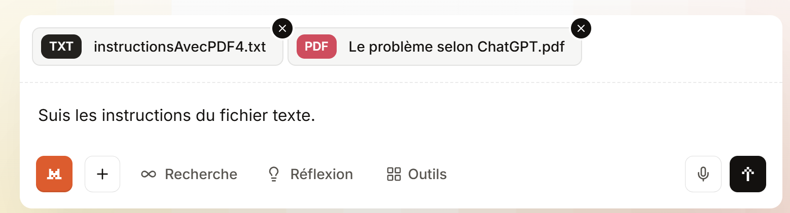

# 8. Résolution des trois problèmes avec MistralAI
## 8.1. Introduction
<table>
<tr>
<td></td>
<td></td>
</tr>
</table>
- En [1], l’URL de l’IA MistralAI [https://chat.mistral.ai/chat] produit de l’entreprise Mistral AI [https://mistral.ai/] ;
- En [2], l’historique de vos questions. Les sessions gratuites de MistralAI sont très limitées en nombre de questions, nombre de fichiers joints, temps passé. J’ai dû prendre un abonnement payant d’un mois pour faire les tests sui suivent ;
- En [3], votre question ;
- En [4], pour joindre des fichiers à votre question ;
- En [5], pour exécuter votre question ;
## 8.2. Le problème 1
La question :

<table>
<tr>
<td></td>
<td></td>
</tr>
</table>
MistralAI répond correctement à la question.

## 8.3. Le problème 2
La question :

<table>
<tr>
<td></td>
<td></td>
</tr>
</table>
On propose à MistralAI de résoudre le problème de calcul de l’impôt 2019 avec les règles de calcul générées par ChatGPT dans le PDF. Le fichier texte donne mes instructions avec les 25 tests à réaliser.

En fait, je n’arriverai à rien avec MistralAI. Le problème principal est qu’il ne lit pas (ou ne veut pas lire) les instructions du fichier texte [instructionsAvecPDF4.txt]. Il génère un code qui ne respecte pas mes exigences et ne génère pas non plus les 25 tests unitaires demandés.
