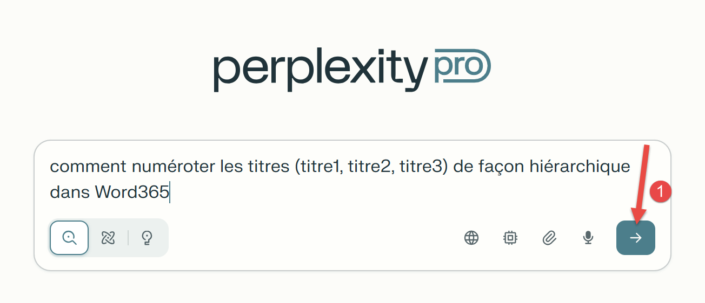
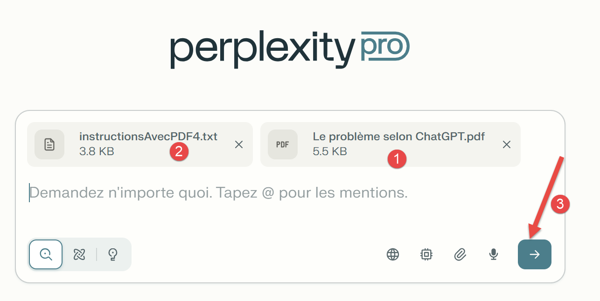

# 10. Résolution des trois problèmes avec Perplexity
## 10.1. Introduction
Voici une copie d’écran de la page d’accueil de l’IA Perplexity :

<table>
<tr>
<td></td>
<td></td>
</tr>
</table>
- En [1], l’URL de Perplexity ;
- En [2], l’icône pour commencer une nouvelle conversation avec l’IA ;
- En [3], on a utilisé la version Pro avec un abonnement payant d’un mois. Avec la version gratuite, on ne peut pas attacher des fichiers à la question posée. Perplexity indique tout de suite qu’il faut passer à la version Pro ;
- En [4], l’icône pour attacher des fichiers à la question posée ;
- En [5], votre question ;
## 10.2. Le problème 1
<table>
<tr>
<td></td>
<td></td>
</tr>
</table>
- En [1], l’icône pour lancer la conversation avec l’IA ;

La réponse est correcte et complète.

## 10.3. Le problème 2
<table>
<tr>
<td></td>
<td></td>
</tr>
</table>
- En [1], on fournit le PDF généré par ChatGPT qui explique le mode de calcul de l’impôt ;
- En [2], on fournit des instructions complémentaires pour la génération du script Python. Ce fichier texte demande la vérification de 25 tests unitaires alors que le PDF n’en propose que 12 ;
- En [3], on lance la conversation ;

Perplexity ne réussira jamais à résoudre le problème. Il a des réponses très bizarres. Ainsi il peut proposer un script Python en indiquant qu’il ne passe pas tous les tests. Quel est l’intérêt de cette réponse alors qu’on lui demande un script qui passe les 25 tests ? Par ailleurs, il a indiqué à de multiples reprises que le script Python qu’il avait généré passait les 25 tests, alors que c’était faux. Testé sous Pycharm, le script généré échouait, la plupart du temps, aux 25 tests. Les réponses de l’IA ont toujours été rapides et toujours fausses. Cette IA s’est révélée très décevante et trompeuse.

Du coup, il m’a semblé inutile de lui proposer la résolution du problème 3.
